#Implementation of Image Difference Decorrelation

<script type="text/javascript" src="http://cdn.mathjax.org/mathjax/latest/MathJax.js?config=default"></script>

# 0. Abstract

Herein, we describe ...

# 1. Introduction

The standard method for PSF matching for image subtraction in the LSST software stack is the method of [Alard & Lupton (1998)](http://adsabs.harvard.edu/abs/1998ApJ...503..325A) (hereafter *A&L*) (also, [Alard, 2000](http://aas.aanda.org/articles/aas/pdf/2000/11/ds8706.pdf])). This procedure is used to estimate a convolution kernel which, when convolved with the template image, matches the PSF of the template image with that of the science image, enabling a clean subtraction. Due to its use of linear basis functions to model the matching kernel, the method can flexibly incorporate spatially-varying PSFs (i.e., via a spatially-varying matching kernel), as well as a spatially-varying differential background. The algorithm has the advantage that it does not require measurement of the images' PSFs. Instead it only needs to model the differential (potentially spatially-varying) matching kernel in order to obtain an optimal subtraction.

Image subtraction using the [A&L](http://adsabs.harvard.edu/abs/1998ApJ...503..325A) method produces an optimal difference image in the case of a noise-less template. However, when the template is noisy (*e.g.*, when the template is comprised of a small number of co-adds), then its convolution with the matching kernel leads to significant covariance of neighboring pixels within the subtracted image, which will affect detection and measurement if not accounted for ([Slater, et al. (2016)](http://dmtn-006.lsst.io); [Price & Magnier (2004)](Pan-STARRS Image Processing Pipeline: PSF-Matching for Subtraction and Stacking)). False detections in this case can be reduced by tracking the covariance matrix, or more *ad-hoc* (as is the current implementation) increasing the detection threshold. 

While LSST will, over its ten-year span, collect dozens of observations per field and passband, at the onset of the survey, this number will be small enough that this issue of noisy templates will be important. Moreover, if we inted to bin templates by airmass to account for differential chromatic refraction (DCR), then the total number of coadds contributing to each template will necesserily be smaller. Finally, depending upon the flavor of coadd ([Bosch, 2016](http://dmtn-015.lsst.io)) used to construct the template, template noise and the resulting covariances in the image difference will be more or less of an issue as the survey progresses.

# 2. Proposal

The goal of PSF matching via [A&L](http://adsabs.harvard.edu/abs/1998ApJ...503..325A) is to estimate the PSF matching kernel $\kappa$ that best matches the PSF of the two images being subtracted, $I_1$ and $I_2$ (typically $I_2$ is the template image, which is convolved with the PSF matching kernel $\kappa$). The image difference $D$ is then $D = I_1 - (\kappa \otimes I_2)$. As mentioned above, due to the convolution ($\kappa  \otimes I_2$), the noise in $D$ will be correlated.

## 2.1. Difference image decorrelation.

An algorithm developed by [Kaiser (2001)](Addition of Images with Varying Seeing. PSDC-002-011-xx) and later rediscovered by [Zackay, et al (2015)](https://arxiv.org/abs/1512.06879) showed that the noise in a PSF-matched coadd image can be decorrelated via noise whitening (i.e. flattening the noise spectrum). The same principle may also be applied to image differencing ([Zackay, et al. (2016)](https://arxiv.org/abs/1601.02655)). In the case of [A&L](http://adsabs.harvard.edu/abs/1998ApJ...503..325A) - based PSF matching, this results in an image difference in Fourier space $\widehat{D}(k)$: 

$$
\widehat{D}(k) = \big[ \widehat{I}_1(k) - \widehat{\kappa}(k) \widehat{I}_2(k) \big] \sqrt{ \frac{ \sigma_1^2 + \sigma_2^2}{ \sigma_1^2 + \widehat{\kappa}^2(k) \sigma_2^2}}
$$

###### Equation 1.

Here, $\sigma_1^2$ and $\sigma_2^2$ are the variances of images $I_1$ and $I_2$, respectively. Thus, we may perform PSF matching to estimate $\kappa$ by standard methods (e.g., [A&L](http://adsabs.harvard.edu/abs/1998ApJ...503..325A) and related methods) and then correct for the noise in the template via [Eq. 1](#equation-1). The term in the square-root of [Eq. 1](#equation-1) is a *post-subtraction convolution kernel* $\widehat{\phi}(k)$, which, when convolved with the image difference, has the effect of decorrelating the noise in the image difference. It also (explicitly) contains an extra factor of $\sqrt{\sigma_1^2+\sigma_2^2}$, which sets the overall adjusted variance of the noise of the image difference (rather than the unit variance set vy the Zackat et al. algorithm). This strategy maintains the advantages described previously: the PSFs of $I_1$ and $I_2$ do not need to be measured, and spatial variations in PSFs may be readily accounted for (although see below). The decorrelation can be relatively inexpensive, as it requires (at least) one *FFT* of $\kappa$ and *iFFT* of $\widehat{\phi}(k)$ (which are both small, of the order 1,000 pixels), followed by one convolution of the difference image. 

# 3. Implementation details

Since the current implementation of [A&L](http://adsabs.harvard.edu/abs/1998ApJ...503..325A) is performed in image space, we chose to implement the image decorrelation in image space as well. The *post-subtraction convolution kernel* $\widehat{\phi}(k)$ is then computed in frequency space from $\widehat{\kappa}(k)$, $\sigma_1$, and $\sigma_2$, and is then inverse Fourier-transformed to a kernel $\phi$ in real space. The image difference is then convolved with $\phi$ to obtain the decorrelated image difference, $D^\prime = \phi \otimes \big[ I_1 - (\kappa \otimes I_2) \big]$. This also allows us to circumvent *FT*-ing the two exposures $I_1$ and $I_2$, which could lead to artifacts due to masked and/or bad pixels.

# 4. Results

## 4.1 Simulated image differences.

We have developed a simple reference implementation of [A&L](http://adsabs.harvard.edu/abs/1998ApJ...503..325A), and applied it to simulated images with point-sources with a variety of signal-to-noise, and different Gaussian PSFs and image variances. We included the capability to simulate spatial PSF variation, including spatially-varying astrometric offsets (which can be incorporated into the [A&L](http://adsabs.harvard.edu/abs/1998ApJ...503..325A) PSF matching kernel). An example input template and science image, as well as PSF-matched template and resulting *diffim* is shown in [Figure 1](#figure-1-image-differencing).

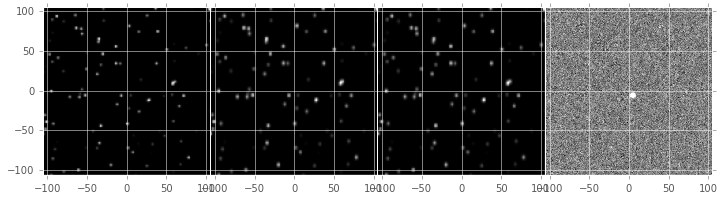

<a name="figure-1-image-differencing"/></a>

###### *Figure 1. Image differencing.*

*From left to right, sample (simulated) template image, PSF-matched template, science image, and difference image. In this simulated example, the source near the center was set to increase in flux by 2% between the science and template "exposures."*

In [Figure 2](#figure-2-kernels), we show the PSF matching kernel ($\kappa$) that was estimated for the images shown in [Figure 1](#figure-1-image-differencing), and the resulting decorrelation kernel, $\phi$. We note that $\phi$ largely has the structure of a delta function, with a small region of negative signal, thus its capability, when convolved with the difference image, to act as an effective "sharpening" kernel.

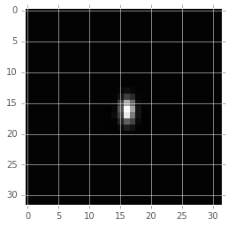
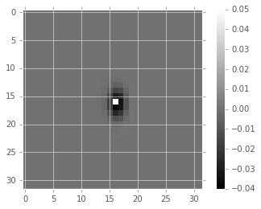

<a name="figure-2-kernels"/></a>

###### *Figure 2. Kernels.*

*Sample PSF matching kernel* $\kappa$ *(left) and resulting decorrelation kernel,* $\phi$ *for the images shown in* [Figure 1](#figure-1-image-differencing).

When we convolve $\phi$ ([Figure 2](#figure-2-kernels), right panel) with the raw image difference ([Figure 1](#figure-1-image-differencing), right-most panel), we obtain the decorrelated image, shown in the left-most panel of [Figure 3](#figure-3-decorrelated-diffim). While the noise visually appears to be greater in the decorrelated image, a closer look at the statistics reveals that this is indeed the case ([Table 1](#table-1-image-difference-statistics), [Figure 4](#figure-4-decorrelated-image-statistics) and [Figure 5](#figure-5-covariance-matrices)). [Table 1](#table-1-image-difference-statistics) and [Figure 4](#figure-4-decorrelated-image-statistics) show that the variance of the decorrelated image has increased. Indeed, the measured variances reveal that the variance of the uncorrected image difference was lower than expected, while the decorrelation has increased the variance to the expected level:

|             | Variance  |  Covariance  |
|-------------|-----------|--------------|
| Corrected   | 0.0778    |  0.300       |
| Original    | 0.0449    |  0.793       |
| Expected    | 0.0800    |  0.004       |
| Zackay, et al. (2016) | 0.987$^*$ | 0.301   |

###### *Table 1. Image difference statistics.*

*Variances and neighbor-pixel covariances for image differences derived from two images each with input variances of 0.2.* $^*$ *Note that the* [Zackay, et al. (2016)](https://arxiv.org/abs/1601.02655) *procedure intrinsically normalizes the image difference to have unit variance. The measure of covariance is actually the sum of off-diagonal terms divided by the sum of the diagonal terms (and should equal 0 for a perfectly diagonal matrix).*

<!--
```python
%In [1]:
print sig1, sig2  # Input std. deviation of template and science images
print 'Corrected:', np.mean(diffim2), np.std(diffim2)
print 'Original: ', np.mean(diffim1), np.std(diffim1)
print 'Expected: ', np.sqrt(sig1**2 + sig2**2)
%Out [1]:
0.2 0.2
Corrected: 10.0042330181 0.293237231242
Original:  9.99913482654 0.211891941431
Expected:  0.282842712475
```
-->

In addition, we see ([Table 1](#table-1-image-difference-statistics) and [Figure 5](#figure-5-covariance-matrices)) that the covariances between neighboring pixels in the image difference has been significantly decreased following convolution with the decorrelation kernel. The covariance matrix has been significantly diagonalized. While the covariance of the decorrelated image might at first glance appear high relative to the random expectation, we show (below) that it is equal to the theoretical value obtained using a basic implementation of the [Zackay, et al. (2016)](https://arxiv.org/abs/1601.02655) algorithm.

<!--
```python
%In [2]:
print np.nansum(cov2)/np.sum(np.diag(cov2))  # cov2 is the covar. matrix of the corrected image.
print np.nansum(cov1)/np.sum(np.diag(cov1))  # cov1 is the covar. matrix of the uncorrected image.
%Out [2]:
0.300482626371
0.793176605206
```
-->

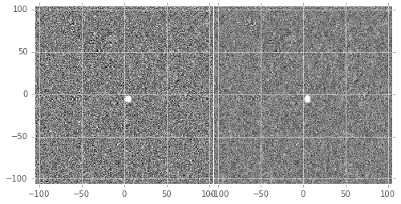

<a name="figure-3-decorrelated-diffim"/></a>

###### *Figure 3. Decorrelated diffim.*

*On the left is the decorrelated image difference,* $D^\prime$. *Original image difference* $D$ *is shown here for comparison, in the right-most panel, with the same intensity scale, as well as in* [Figure 1](#figure-1-image-differencing).

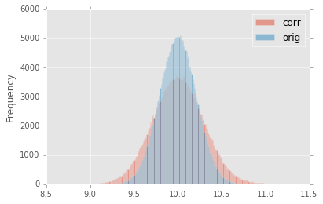

<a name="figure-4-decorrelated-image-statistics"/></a>

###### *Figure 4. Decorrelated image statistics.*

*Histogram of sigma-clipped pixels in the original image difference* $D$ *(blue; 'orig') and the decorrelated image difference* $D^\prime$ *(red; 'corr') in* [Figure 3](#figure-3-decorrelated-diffim).

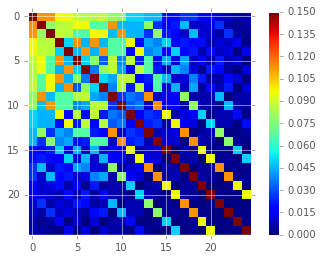
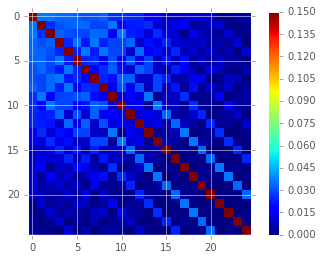

<a name="figure-5-covariance-matrices"/></a>

###### *Figure 5. Covariance matrices.*

*Covariance between neighboring pixels in the original, uncorrected image difference*  $D$ *(left) and the decorrelated image difference* $D^\prime$ *(right) in* [Figure 3](#figure-3-decorrelated-diffim).

## 4.2. Comparison with Zackay, et al (2016).

We developed a basic implementation of the [Zackay, et al. (2016)](https://arxiv.org/abs/1601.02655) "proper" image differencing procedure in order to compare image differences (see [Appendex 7.A. for details](#a-appendix-a-implementation-of-basic-zackay-et-al-2016-algorithm)). Our implementation simply applies Equation (14) of their manuscript to the two simulated images, providing the (known) PSFs and variances as input:

$$
\widehat{D} = \frac{F_r\widehat{P_r}\widehat{N} - F_n\widehat{P_n}\widehat{R}}{\sqrt{\sigma_n^2 F_r^2 \left|\widehat{P_r}\right|^2 + \sigma_r^2 F_n^2 \left|\widehat{P_n}\right|^2}},
$$

######Equation 2.

where $D$ is the proper difference image, $R$ and $N$ are the reference and "new" image, respectively, $P_r$ and $P_n$ are their PSFs, $F_r$ and $F_n$ are their flux-based zero-points (which we will set to one here), $\sigma_r^2$ and $\sigma_n^2$ are their variance, and $\widehat{D}$ denotes the FT of $D$.
As shown in [Table 1](#table-1-image-difference-statistics), many of the bulk statistics between image differences derived via the two methods are (as expected) nearly identical. In fact, the two "optimal" image differences are nearly identical, as we show in [Figure 6](#figure-6-diffim-difference). The variance of the difference between the two difference images is of the order of 0.05% of the variances of the individual images.

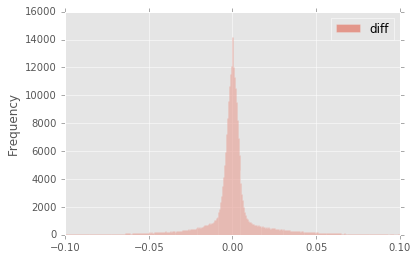

<a name="figure-6-diffim-difference"/></a>

###### *Figure 6. Diffim difference.*

*Histogram of pixel-wise difference between optimal image differences. Each image difference has been rescaled to unit variance to facilitate differencing.*

## 4.3. Application to real data.

We have implemented tested the proposed decorrelation method in the LSST software stack, and applied it to real data obtained from DECam. For this image differencing experiment, we used the standard [A&L](http://adsabs.harvard.edu/abs/1998ApJ...503..325A) procedure with a spatially-varying PSF matching kernel (default configuration parameters). This computation may be turned on by setting the option `doDecorrelation=True` in the `imageDifference.py` command-line task in `pipe_tasks`. The decorrelation code itself resides in `ip_diffim`. In [Figure 7](#figure-7) we show subimages of two astrometrically aligned input exposures, the PSF-matched template image, and the image difference.

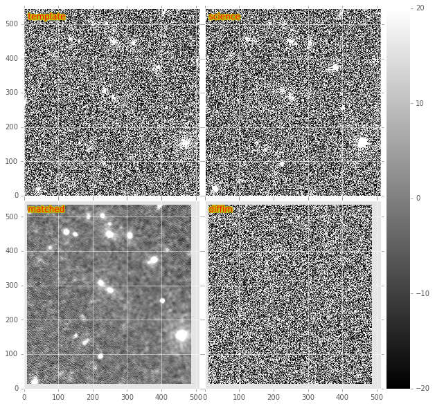

<a name="figure-7"/></a>

###### *Figure 7.*

*Image differencing on real (DECam) data. Subimages of the two input exposures (top), the PSF-matched image (bottom-left), and the image difference (bottom-right).*

To perform image decorrelation in this case, we simply extracted the matching kernel $\kappa$ estimated for the center of the image, computed a constant image variance $\sigma_1^2$ and $\sigma_2^2$ over each entire image (sigma-clipped mean of its variance plane; in this example 60.0 and 62.8 for the template and science images, respectively), and computed the decorrelation kernel $\phi$ from those three quantities ([Figure 8](#figure-8)). The resulting decorrelated image difference has a greater variance (125.5 vs. 66.8, naive expected value $60.0+62.8=122.8$). Additionally, we show in [Figure 9](#figure-9) that the decorrelated DECam image indeed has a lower neighboring-pixel covariance (4.39% off-diagonal variance, vs. 34.9% for the uncorrected diffim).

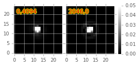
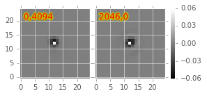

<a name="figure-8"/></a>

###### *Figure 8.*

*Image differencing on real (DECam) data. PSF matching kernels (left) and corresponding decorrelation kernels (right). Shown are kernels derived from two corners of the image which showed the greatest variation in the matching kernels (pixel coordinates overlaid).*

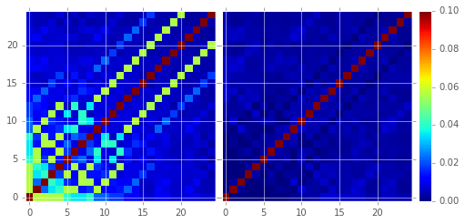

<a name="figure-9"/></a>

###### *Figure 9.*

*Image differencing on real (DECam) data. Neighboring pixel covariance matrices for uncorrected (left) and corrected (right) image difference.*


## 4.4. Effects of diffim decorrelation on detection and measurement

See [this notebook](https://github.com/lsst-dm/diffimTests/blob/master/20.%20compare%20photometry.ipynb).

The higher variance of the decorrelated image difference results in a smaller number of `diaSource` detections ($\sim$ 70% fewer) at the same (5.5-$\sigma$) detection threshold ([Table 2](#table-2)). Notably, the detection count does not increase significantly for the decorrelated image difference when the detection threshold is set to the canonical 5.0-$\sigma$ level, whereas it does for the uncorrected image difference (which is why the standard `diaSource` detection threshold has typically been set to 5.5-$\sigma$ until now). Also of note, 45 of the 47 `diaSources` detected in the decorrelated image are also detected in the uncorrected image difference.

<a name="table-2"/></a>

| Decorrelated?	| Detection threshold	| Positive detected | Negative detected | Merged detected
|-------------------|-------------------|--------------|--------------|----------------|
| Yes | 5.0	| 40	| 18	| 47 |
| Yes | 5.5	| 35	| 15	| 41 |
| No  | 5.0	| 89	| 328 |	395 |
| No  | 5.5	| 58   |	98 |	143 |

###### *Table 2.*

*Comparison of numbers of* `diaSources` *detected in DECam image difference run with decorrelation turned on or off, and with a 5.5-* $\sigma$ *or 5.0-* $\sigma$ *detection threshold.*

# 5. Conclusions and future work

Some conclusions are going to go here.

## 5.1. Accounting for spatial variations in noise (variance) and matching kernel

There are likely to be spatial variations across an image of the PSF matching kernel and the template- and science-image variances. These three parameters separately could contribute to spatial variations in the decorrelation kernel $\phi$, with unknown effects. (A primary effect is that, if these parameters are computed just for the center of the images and then the resulting $\phi$ is only accurate for the center of the image, and could lead to over/under-correction of the correlated noise nearer to the edges of the image difference. Another effect is that the resulting image difference PSF will also not include the accurate spatial variations.) 

We explored the effect of spatial variations in all three of these parameters for a single example DECam image subtraction. The PSF matching kernel for this image varies across the image ([Figure 8](#figure-8)), and thus so does the resulting decorrelation kernel, $\phi$. Additionally, the noise (quantified in the variance planes of the two exposures) varies across both the template and science images by $\sim 1\%$ (data not shown here, but see [this IPython notebook](https://github.com/lsst-dm/diffimTests/blob/master/19.%20check%20variance%20planes.ipynb)). We computed decorrelation kernels $\phi_i$ for the observed extremes of each of these three parameters, and compared the resulting decorrelated image differences to the canonical decorrelated image difference computed using $\phi$ computed for the center of the images. The distribution of variances (sigma-clipped means of the variance plane) of the resulting decorrelated image differences differed by as much as $\sim 6.0\%$ at the extreme ($\sim 1.5\%$ standard deviation).

This result suggests that we need to compute $\phi$ on a grid across the image, and (ideally) perform an interpolation to estimate a spatially-varying $\phi(x,y)$.

# 6. Appendix

### 6.A. Appendix A. Technical considerations.

1. A complication arises in deriving the decorrelation kernel, in that the kernel starts-off with odd-sized pixel dimensions, but must be even-sized for FFT. Then once it is inverse-FFT-ed, it must be re-shaped to odd-sized again for convolution. This must be done with care to avoid small shifts in the pixels of the resulting decorrelated image difference.

2. Should we use the original (unwarped) template to compute the variance $\sigma_2$ that enters into the computation of the decorrelation kernel, or should we use the warped template? The current implementation uses the warped template. This should not matter so long as we know that the variance plane gets handled correctly by the warping procedure.

### 6.B. Appendix B. Implementation of basic Zackay et al. (2016) algorithm.

We only applied the basic Zackay, et al. (2016) procedure to a small simulated image. 

```python
def performZackay(R, N, P_r, P_n, sig1, sig2):
    from scipy.fftpack import fft2, ifft2, ifftshift

    F_r = F_n = 1.  # Don't worry about flux scaling here.
    P_r_hat = fft2(P_r)
    P_n_hat = fft2(P_n)
    d_hat_numerator = (F_r * P_r_hat * fft2(N) - F_n * P_n_hat * fft2(R))
    d_hat_denom = np.sqrt((sig1**2 * F_r**2 * np.abs(P_r_hat)**2) + (sig2**2 * F_n**2 * np.abs(P_n_hat)**2))
    d_hat = d_hat_numerator / d_hat_denom

    d = ifft2(d_hat)
    D = ifftshift(d.real)
    return D
```

### 6.C. Appendix C. Notebooks and code

All figures in this document and related code are from notebooks in [the diffimTests github repository](https://github.com/lsst-dm/diffimTests), in particular, [this](https://github.com/lsst-dm/diffimTests/blob/master/14.%20Test%20Lupton(ZOGY)%20post%20convolution%20kernel%20on%20simulated%20(noisy)%202-D%20data%20with%20a%20variable%20source-updated.ipynb), [this](https://github.com/lsst-dm/diffimTests/blob/master/13.%20compare%20L(ZOGY)%20and%20ZOGY%20diffims%20and%20PSFs.ipynb), [this](https://github.com/lsst-dm/diffimTests/blob/master/17.%20Do%20it%20in%20the%20stack%20with%20real%20data.ipynb), and [this](https://github.com/lsst-dm/diffimTests/blob/master/19.%20check%20variance%20planes.ipynb) one.

The decorrelation procedure described in this technote are implemented in the `ip_diffim` and `pipe_tasks` LSST Github repos.

# 7. References

Some references are going to go here. Perhaps.

