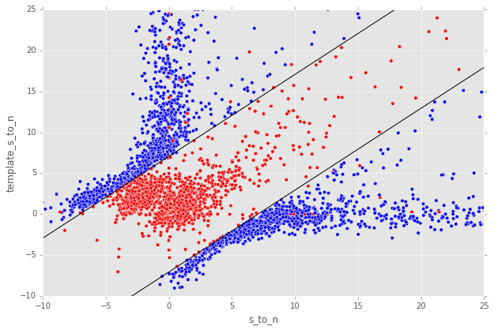

#Implementation of Image Difference Decorrelation for LSST Transient Detection

<script type="text/javascript" src="http://cdn.mathjax.org/mathjax/latest/MathJax.js?config=default"></script>

# 0. Abstract

Herein, we describe a method for decorrelating image differences produced by the [Alard & Lupton (1998)](http://adsabs.harvard.edu/abs/1998ApJ...503..325A) method of PSF matching. Insipired by the recent work of [Zackay, et al (2015)](https://arxiv.org/abs/1512.06879) and the previous work of [Kaiser (2001)](Addition of Images with Varying Seeing. PSDC-002-011-xx), this proposed method uses a single post-subtraction convolution of an image difference to remove the neighboring pixel covariances in the image difference that result from the convolution of the template image by the PSF matching kernel. We describe the method in detail, analyze its effects on image differences (both real and simulated) as well as on detections and photometry of `diaSources` in decorrelated image differences. We also compare the decorrelated image differences with those resulting from a basic implementation of [Zackay, et al (2015)](https://arxiv.org/abs/1512.06879). We describe the implementation of the new correction in the LSST image differencing pipeline, and discuss potential issues and areas of future research.

# 1. Introduction

Image subtraction analysis, also referred to as "difference image analysis", or "DIA", is the standard method for identifying and measuring transients and variables in astronomical images. In DIA, a science image is subtracted from a template image (hereafter, simply, "template"), in order to identify transients from either image. In the LSST stack (and most other existing transient detection pipelines), optimal image subtraction is enabled through point spread function (PSF) matching via the method of [Alard & Lupton (1998)](http://adsabs.harvard.edu/abs/1998ApJ...503..325A) (hereafter *A&L*) (also, [Alard, 2000](http://aas.aanda.org/articles/aas/pdf/2000/11/ds8706.pdf])). This procedure is used to estimate a convolution kernel which, when convolved with the template, matches the PSF of the template with that of the science image. The [A&L](http://adsabs.harvard.edu/abs/1998ApJ...503..325A) procedure  uses linear basis functions to model the matching kernel which can flexibly incorporate spatially-varying PSFs (via a spatially-varying matching kernel), as well as a spatially-varying differential background. The algorithm has the advantage that it does not require direct measurement of the images' PSFs. Instead it only needs to model the differential (potentially spatially-varying) matching kernel in order to obtain an optimal subtraction. Additionally it does not require performing a Fourier transform of the exposures; thus no issues arise with handling masked pixels and other artefacts.

Image subtraction using the [A&L](http://adsabs.harvard.edu/abs/1998ApJ...503..325A) method produces an optimal difference image in the case of a noise-less template. However, when the template is noisy (*e.g.*, when the template is comprised of a small number of co-adds), then its convolution with the matching kernel leads to significant covariance of neighboring pixels within the resulting subtracted image, which will adversely affect accurate detection and measurement if not accounted for ([Slater, et al. (2016)](http://dmtn-006.lsst.io); [Price & Magnier (2004)](Pan-STARRS Image Processing Pipeline: PSF-Matching for Subtraction and Stacking)). False detections in this case can be reduced by tracking the covariance matrix, or more *ad-hoc*, increasing the detection threshold (as is the current implementation, where detection is performed at 5.5-$\sigma$ rather than the canonical 5.0-$\sigma$). 

While LSST will, over its ten-year span, collect dozens of observations per field and passband, at the onset of the survey, this number will be small enough that this issue of noisy templates will be important. Moreover, if we inted to bin templates by airmass to account for differential chromatic refraction (DCR), then the total number of coadds contributing to each template will necesserily be smaller. Finally, depending upon the flavor of coadd ([Bosch, 2016](http://dmtn-015.lsst.io)) used to construct the template, template noise and the resulting covariances in the image difference will be more or less of an issue as the survey progresses.

In this DMTN, we describe a proposal to *decorrelate* an [A&L](http://adsabs.harvard.edu/abs/1998ApJ...503..325A) optimal image difference. We describe its implementation in the LSST stack, and show that it has the desired effects on the noise and covariance properties of simulated images. Finally, we perform a similar analysis on a set of DECam image differences, and show that this method has the desired effects on detection rates and properties in the image differences.

# 2. Proposal

The goal of PSF matching via [A&L](http://adsabs.harvard.edu/abs/1998ApJ...503..325A) is to estimate the PSF matching kernel $\kappa$ that best matches the PSF of the two images being subtracted, $I_1$ and $I_2$ (typically $I_2$ is the template image, which is convolved with the PSF matching kernel $\kappa$). The image difference $D$ is then $D = I_1 - (\kappa \otimes I_2)$. As mentioned above, due to the convolution ($\kappa \otimes I_2$), the noise in $D$ will be correlated.

## 2.1. Difference image decorrelation.

An algorithm developed by [Kaiser (2001)](Addition of Images with Varying Seeing. PSDC-002-011-xx) and later rediscovered by [Zackay, et al (2015)](https://arxiv.org/abs/1512.06879) showed that the noise in a PSF-matched coadd image can be decorrelated via noise whitening (i.e. flattening the noise spectrum). The same principle may also be applied to image differencing ([Zackay, et al. (2016)](https://arxiv.org/abs/1601.02655)). In the case of [A&L](http://adsabs.harvard.edu/abs/1998ApJ...503..325A) - based PSF matching, this results in an image difference in Fourier space $\widehat{D}(k)$: 

$$
\widehat{D}(k) = \big[ \widehat{I}_1(k) - \widehat{\kappa}(k) \widehat{I}_2(k) \big] \sqrt{ \frac{ \sigma_1^2 + \sigma_2^2}{ \sigma_1^2 + \widehat{\kappa}^2(k) \sigma_2^2}}
$$

###### *Equation 1.*

Here, $\sigma_1^2$ and $\sigma_2^2$ are the variances of images $I_1$ and $I_2$, respectively. Thus, we may perform PSF matching to estimate $\kappa$ by standard methods (e.g., [A&L](http://adsabs.harvard.edu/abs/1998ApJ...503..325A) and related methods) and then correct for the noise in the template via [Eq. 1](#equation-1). The term in the square-root of [Eq. 1](#equation-1) is a *post-subtraction convolution kernel* $\widehat{\phi}(k)$, 

$$
\widehat{\phi}(k) = \sqrt{ \frac{ \sigma_1^2 + \sigma_2^2}{ \sigma_1^2 + \widehat{\kappa}^2(k) \sigma_2^2}},
$$

###### *Equation 2.*

which is convolved with the image difference, and has the effect of decorrelating the noise in the image difference. It also (explicitly) contains an extra factor of $\sqrt{\sigma_1^2+\sigma_2^2}$, which sets the overall adjusted variance of the noise of the image difference (in contrast to the unit variance set by the algorithm proposed by [Zackay, et al. (2016)](https://arxiv.org/abs/1601.02655)). 

## 2.2. Implementation details

Since the current implementation of [A&L](http://adsabs.harvard.edu/abs/1998ApJ...503..325A) is performed in (real) image space, we choose to implement the image decorrelation in image space as well. The *post-subtraction convolution kernel* $\widehat{\phi}(k)$ is computed in frequency space from $\widehat{\kappa}(k)$, $\sigma_1$, and $\sigma_2$ ([Equation 2](#equation-2), and is inverse Fourier-transformed to a kernel $\phi$ in real space. The image difference is then convolved with $\phi$ to obtain the decorrelated image difference, $D^\prime = \phi \otimes \big[ I_1 - (\kappa \otimes I_2) \big]$. This allows us to circumvent *FT*-ing the two exposures $I_1$ and $I_2$, which could lead to artifacts due to masked and/or bad pixels. Finally, the resulting PSF of $D^\prime$, important for detection and measurement of `diaSources`, is simply the convolution of the PSF of $D$ with $\phi$.

## 2.3. Comparison of diffim decorrelation and Zackay, et al (2016).

The decorrelation strategy described above is basically an "afterburner" correction to the standard image differencing algorithm which has been in wide use for over a decade. Thus it was relatively straightforward to integrate directly into the LSST image differencing (`ip_diffim`) pipeline. It maintains the advantages described previously that are implicit to the [A&L](http://adsabs.harvard.edu/abs/1998ApJ...503..325A) algorithm: the PSFs of $I_1$ and $I_2$ do not need to be measured, and spatial variations in PSFs may be readily accounted for. The decorrelation can be relatively inexpensive, as it requires one *FFT* of $\kappa$ and one *inverse-FFT* of $\widehat{\phi}(k)$ (which are both small, of order 1,000 pixels), followed by one convolution of the difference image. Image masks are maintained, and the variance plane in the decorrelated image difference is also adjusted to the correct variance.

The decorrelation proposal is quite distinct from the image differencing method proposed by [Zackay, et al. (2016)](https://arxiv.org/abs/1601.02655), which involves FFT-ing the two input images and their PSFs. It also requires accurate measurements of PSFs of the two images, including any bulk astrometric offsets (which would be incorporated into the PSFs). It is not clear how information in the images' variance planes would be propagated to the final image difference (although theoretically, the two variance planes could simply be added).

Of note, the [Zackay, et al. (2016)](https://arxiv.org/abs/1601.02655) procedure is symmetric in $I_1$ and $I_2$ (i.e., it does not explicitly require $I_1$ to have a broader PSF than $I_2$), whereas the standard [A&L](http://adsabs.harvard.edu/abs/1998ApJ...503..325A) will not work correctly if this is not the case. (Deconvolution of the template, or "pre-convolution" of the science image are possible methods to address this concern with [A&L](http://adsabs.harvard.edu/abs/1998ApJ...503..325A).) It has also been claimed   ([Zackay, et al. (2016)](https://arxiv.org/abs/1601.02655)) that the [Zackay, et al. (2016)](https://arxiv.org/abs/1601.02655) procedure produces cleaner image subtractions in cases of (1) perpendicular-oriented PSFs and (2) astrometric jitter. This claim has yet to be investigated thoroughly using the LSST [A&L](http://adsabs.harvard.edu/abs/1998ApJ...503..325A) implementation.

# 3. Results

## 3.1 Simulated image differences.

We developed a simple reference implementation of [A&L](http://adsabs.harvard.edu/abs/1998ApJ...503..325A), and applied it to simulated images with point-sources with a variety of signal-to-noise, and different (elliptical) Gaussian PSFs and (constant) image variances. We included the capability to simulate spatial PSF variation, including spatially-varying astrometric offsets (which can be modeled by the [A&L](http://adsabs.harvard.edu/abs/1998ApJ...503..325A) PSF matching kernel). An example input template and science image, as well as PSF-matched template and resulting *diffim* is shown in [Figure 1](#figure-1-image-differencing).


<a name="figure-1-image-differencing"/></a>

###### *Figure 1. Image differencing.*

*From left to right, sample (simulated) template image, PSF-matched template, science image, and difference image. In this simulated example, the source near the center was set to increase in flux by 2% between the science and template "exposures."*

In [Figure 2](#figure-2-kernels), we show the PSF matching kernel ($\kappa$) that was estimated for the images shown in [Figure 1](#figure-1-image-differencing), and the resulting decorrelation kernel, $\phi$. We note that $\phi$ largely has the structure of a delta function, with a small region of negative signal, thus its capability, when convolved with the difference image, to act effectively as a "sharpening" kernel.


<a name="figure-2-kernels"/></a>

###### *Figure 2. Kernels.*

*Sample PSF matching kernel* $\kappa$ *(left) and resulting decorrelation kernel,* $\phi$ *for the images shown in* [Figure 1](#figure-1-image-differencing).

When we convolve $\phi$ ([Figure 2](#figure-2-kernels), right panel) with the raw image difference ([Figure 1](#figure-1-image-differencing), right-most panel), we obtain the decorrelated image, shown in the left-most panel of [Figure 3](#figure-3-decorrelated-diffim). The noise visually appears to be greater in the decorrelated image, and a closer look at the statistics reveals that this is indeed the case ([Table 1](#table-1-image-difference-statistics), [Figure 4](#figure-4-decorrelated-image-statistics) and [Figure 5](#figure-5-covariance-matrices)). [Figure 4](#figure-4-decorrelated-image-statistics) shows that the variance of the decorrelated image has increased. Indeed, the measured variances ([Table 1](#table-1-image-difference-statistics)) reveal that the variance of the uncorrected image difference was lower than expected, while the decorrelation has increased the variance to the expected level:

|             | Variance  |  Covariance  |
|-------------|-----------|--------------|
| Corrected   | 0.0778    |  0.300       |
| Original    | 0.0449    |  0.793       |
| Expected    | 0.0800    |  0.004       |
| Zackay, et al. (2016) | 0.987$^*$ | 0.301   |

###### *Table 1. Image difference statistics.*

*Variances and neighbor-pixel covariances for image differences derived from two images each with input variances of 0.2.* $^*$*Note that the* [Zackay, et al. (2016)](https://arxiv.org/abs/1601.02655) *procedure intrinsically normalizes the image difference to have unit variance. The measure of covariance is actually the sum of off-diagonal terms divided by the sum of the diagonal terms (and should equal 0 for a perfectly diagonal matrix).*

<!--
```python
%In [1]:
print sig1, sig2  # Input std. deviation of template and science images
print 'Corrected:', np.mean(diffim2), np.std(diffim2)
print 'Original: ', np.mean(diffim1), np.std(diffim1)
print 'Expected: ', np.sqrt(sig1**2 + sig2**2)
%Out [1]:
0.2 0.2
Corrected: 10.0042330181 0.293237231242
Original:  9.99913482654 0.211891941431
Expected:  0.282842712475
```
-->

In addition, we see ([Table 1](#table-1-image-difference-statistics) and [Figure 5](#figure-5-covariance-matrices)) that the covariances between neighboring pixels in the image difference has been significantly decreased following convolution with the decorrelation kernel. The covariance matrix has been significantly diagonalized. While the covariance of the decorrelated image might at first glance appear high relative to the random expectation, we show (below) that it is equal to the value obtained using a basic implementation of the [Zackay, et al. (2016)](https://arxiv.org/abs/1601.02655) "proper" image subtraction procedure.

<!--
```python
%In [2]:
print np.nansum(cov2)/np.sum(np.diag(cov2))  # cov2 is the covar. matrix of the corrected image.
print np.nansum(cov1)/np.sum(np.diag(cov1))  # cov1 is the covar. matrix of the uncorrected image.
%Out [2]:
0.300482626371
0.793176605206
```
-->


<a name="figure-3-decorrelated-diffim"/></a>

###### *Figure 3. Decorrelated diffim.*

*On the left is the decorrelated image difference,* $D^\prime$. *Original image difference* $D$ *is shown here for comparison, in the right-most panel, with the same intensity scale, as well as in* [Figure 1](#figure-1-image-differencing).


<a name="figure-4-decorrelated-image-statistics"/></a>

###### *Figure 4. Decorrelated image statistics.*

*Histogram of sigma-clipped pixels in the original image difference* $D$ *(blue; 'orig') and the decorrelated image difference* $D^\prime$ *(red; 'corr') in* [Figure 3](#figure-3-decorrelated-diffim).


<a name="figure-5-covariance-matrices"/></a>

###### *Figure 5. Covariance matrices.*

*Covariance between neighboring pixels in the original, uncorrected image difference*  $D$ *(left) and the decorrelated image difference* $D^\prime$ *(right) in* [Figure 3](#figure-3-decorrelated-diffim).

## 3.2. Comparison with Zackay, et al (2016).

We developed a basic implementation of the [Zackay, et al. (2016)](https://arxiv.org/abs/1601.02655) "proper" image differencing procedure in order to compare image differences (see [Appendex 5.B. for details](#b-appendix-ii-implementation-of-basic-zackay-et-al-2016-algorithm)). Our implementation simply applies Equation (14) of [their manuscript](https://arxiv.org/abs/1601.02655) to the two simulated images, providing the (known) PSFs and variances as input:

$$
\widehat{D} = \frac{F_r\widehat{P_r}\widehat{N} - F_n\widehat{P_n}\widehat{R}}{\sqrt{\sigma_n^2 F_r^2 \left|\widehat{P_r}\right|^2 + \sigma_r^2 F_n^2 \left|\widehat{P_n}\right|^2}},
$$

###### *Equation 3.*

where $D$ is the proper difference image, $R$ and $N$ are the reference and "new" image, respectively, $P_r$ and $P_n$ are their PSFs, $F_r$ and $F_n$ are their flux-based zero-points (which we will set to one here), $\sigma_r^2$ and $\sigma_n^2$ are their variance, and $\widehat{D}$ denotes the FT of $D$. This expression is in Fourier space, and we inverse-FFT the image difference $\widehat{D}$ to obtain the final image $D$.
As shown in [Table 1](#table-1-image-difference-statistics), many of the bulk statistics between image differences derived via the two methods are (as expected) nearly identical. In fact, the two "optimal" image differences are nearly identical, as we show in [Figure 6](#figure-6-diffim-difference). The variance of the difference between the two difference images is of the order of 0.05% of the variances of the individual images.


<a name="figure-6-diffim-difference"/></a>

###### *Figure 6. Diffim difference.*

*Histogram of pixel-wise difference between optimal image differences. Each image difference has been rescaled to unit variance to facilitate differencing.*

## 3.3. Application to real data.

We have implemented and tested the proposed decorrelation method in the LSST software stack as a new `lsst.pipe.base.Task` subclass called `lsst.ip.diffim.DecorrelateALKernelTask`, and applied it to real data obtained from DECam. For this image differencing experiment, we used the standard [A&L](http://adsabs.harvard.edu/abs/1998ApJ...503..325A) procedure with a spatially-varying PSF matching kernel (default configuration parameters). The decorrelation computation may be turned on by setting the option `doDecorrelation=True` for the `imageDifference.py` command-line task. In [Figure 7](#figure-7) we show subimages of two astrometrically aligned input exposures, the PSF-matched template image, and the decorrelated image difference.


<a name="figure-7"/></a>

###### *Figure 7.*

*Image differencing on real (DECam) data. Subimages of the two input exposures (top; science image has been astrometrically aligned with the template), the PSF-matched science image (bottom-left), and the decorrelated image difference (bottom-right).*

`DecorrelateALKernelTask` simply extracts the [A&L](http://adsabs.harvard.edu/abs/1998ApJ...503..325A) PSF matching kernel $\kappa$ estimated previously by `lsst.ip.diffim.ImagePsfMatchTask.subtractExposures()` for the center of the image, and estimates a constant image variance $\sigma_1^2$ and $\sigma_2^2$ for each image (sigma-clipped mean of its entire variance plane; in this example 62.8 and 60.0 for the science and template images, respectively). The task then computes the decorrelation kernel $\phi$ from those three quantities ([Figure 8](#figure-8)). As expected, the resulting decorrelated image difference has a greater variance than the "uncorrected" image difference (120.8 vs. 66.8), and a value close to the naive expected variance $60.0+62.8=122.8$. Additionally, we show in [Figure 9](#figure-9) that the decorrelated DECam image indeed has a lower neighboring-pixel covariance (6.0% off-diagonal covariance, vs. 35% for the uncorrected diffim).


<a name="figure-8"/></a>

###### *Figure 8.*

*Image differencing on real (DECam) data. PSF matching kernels (left) and corresponding decorrelation kernels (right). Shown are kernels derived from two corners of the image which showed the greatest variation in the matching kernels (pixel coordinates overlaid).*


<a name="figure-9"/></a>

###### *Figure 9.*

*Image differencing on real (DECam) data. Neighboring pixel covariance matrices for uncorrected (left) and corrected (right) image difference.*


## 3.4. Effects of diffim decorrelation on detection and measurement

See [this notebook](https://github.com/lsst-dm/diffimTests/blob/master/20.%20compare%20photometry.ipynb).

The higher variance of the decorrelated image difference results in a smaller number of `diaSource` detections ($\sim$ 70% fewer) at the same default (5.5-$\sigma$) detection threshold ([Table 2](#table-2)). Notably, the detection count does not increase substantially ($\sim 14\%$ increase ) for the decorrelated image difference when the detection threshold is set to the canonical 5.0-$\sigma$ level, whereas it does ($\sim 176\%$ increase) for the uncorrected image difference (which is why the standard `diaSource` detection threshold has typically been set to 5.5-$\sigma$ until now). 

<a name="table-2"/></a>

| Decorrelated?	| Detection threshold	| Positive detected | Negative detected | Merged detected
|-------------------|-------------------|--------------|--------------|----------------|
| Yes | 5.0	| 43	| 18	| 50 |
| Yes | 5.5	| 35	| 15	| 41 |
| No  | 5.0	| 89	| 328 |	395 |
| No  | 5.5	| 58   |	98 |	143 |

###### *Table 2.*

*Comparison of numbers of* `diaSources` *detected in DECam image difference run with decorrelation turned on or off, and with a 5.5-* $\sigma$ *or 5.0-* $\sigma$ *detection threshold.*

We matched the catalogs of detections between the uncorrected ("undecorrelated") and decorrelated image differences (to within $5^{\prime\prime}$), and found that 45 of the 47 `diaSources` detected in the decorrelated image are also detected in the uncorrected image difference. We compared the aperture photometry of the 45 matched `diaSources` in the two catalogs (using the `base_CircularApertureFlux_50_0_flux` measurement) using a linear regression to quantify any differential offset and scaling. (We did not filter to remove dipoles, as the `DipoleClassification` task is still a work in progress and doing so would remove a large number of `diaSources`. We found that there is no significant photometric offset between measurements in the two images, while the flux measurement is $\sim 4.5 \pm 0.5\%$ lower in the decorrelated image. Unsurprisingly, the quantified errors in the flux measurements (`base_CircularApertureFlux_50_0_fluxSigma`) are $\sim 120 \pm 5\%$ greater in the decorrelated image.

A more thorough analysis would involve recapitulating some of the work of [Slater, et al (2016)](http://dmtn-006.lsst.io), which described the issue with per-pixel covariance in [A&L](http://adsabs.harvard.edu/abs/1998ApJ...503..325A) image differences generated by the LSST stack and the resulting issues with detection and measurement, but this time using the decorrelated image differences. With the help of Dr. Slater, we performed exactly his analysis on the same set of DECam images as described in [Slater, et al (2016)](http://dmtn-006.lsst.io). In [Figure 10](#figure-10) below, we present an updated version of [Figure 6 from Slater, et al. (2016)](http://dmtn-006.lsst.io/#forcephot-sci-template-v197367) after decorrelation has been performed. Our analysis shows that the detections in the decorrelated image difference are now nicely tracking just at or above the $5\sigma$ threshold. 



<a name="figure-10"/></a>

###### *Figure 10.*

*As in Figure 6 from [Slater, et al. (2016)](http://dmtn-006.lsst.io/en/latest/#forcephot-sci-template-v197367): PSF photometry in the template and science exposures, forced on the positions of diaSource detections in the image difference following image difference decorrelation. The parallel diagonal lines denote science−template* $>5\sqrt{2}\sigma$ *and science−template* $< 5\sqrt{2}\sigma$, *which are the intended criteria for detection. The numerous detections just at or below these detection thresholds  have been eliminated, and (ignoring the two clouds of detections near (0, 0) and (-2.5, 2.5)) the primary detections are above (or below) the detection thresholds.*

# 4. Conclusions and future work

We have shown that performing image difference decorrelation as an "afterburner" post-processing step to [A&L](http://adsabs.harvard.edu/abs/1998ApJ...503..325A) image differences generated by the LSST stack is an effective method to eliminate most issues arising from the per-pixel covariance in said images. We also showed that the resulting decorrelated image differences have similar statistical and noise properties to those generated using the method recently proposed by [Zackay, et al. (2016)](https://arxiv.org/abs/1601.02655).

There still exist several outstanding issues or questions related to details of the decorrelation procedure as it is implemented in the LSST stack. We now describe several of those.

## 4.1. Accounting for spatial variations in noise (variance) and matching kernel

There will be spatial variations across an image of the PSF matching kernel and the template- and science-image per-pixel variances (an example of this is shown in [Figure 8](#figure-8). These three parameters separately will contribute to spatial variations in the decorrelation kernel $\phi$, with unknown second-order effects. A primary effect is that, if these parameters are computed just for the center of the images, then the resulting $\phi$ is only accurate for the center of the image, and could lead to over/under-correction of the correlated noise nearer to the edges of the image difference. Another effect is that the resulting image difference PSF will also not include the accurate spatial variations.

We explored the effect of spatial variations in all three of these parameters for a single example DECam image subtraction. The PSF matching kernel for this image varies across the image ([Figure 8](#figure-8)), and thus so does the resulting decorrelation kernel, $\phi$. Additionally, the noise (quantified in the variance planes of the two exposures) varies across both the template and science images by $\sim 1\%$ (data not shown here, but see [this IPython notebook](https://github.com/lsst-dm/diffimTests/blob/master/19.%20check%20variance%20planes.ipynb)). We computed decorrelation kernels $\phi_i$ for the observed extremes of each of these three parameters, and compared the resulting decorrelated image differences to the canonical decorrelated image difference computed using $\phi$ computed for the center of the images. The distribution of variances (sigma-clipped means of the variance plane) of the resulting decorrelated image differences differed by as much as $\sim 5.6\%$ at the extreme ($\sim 1.3\%$ standard deviation). The per-pixel covariance in the resulting images varied by as much as $\sim 50\%$ at the extreme ($\sim 25\%$ standard deviation) but all represented significant reductions from $34.9\%$ in the uncorrected image difference, down to between $4.0$ and $8.0\%$. Finally, the number of detections on the image differences varied by $10\%$ at the extremes ($2.2\%$ standard deviation) around $\sim 50$ detections total. We have yet to investiate DIA source measurement, which could be affected by the assumption of a constant PSF across the image difference.

We have not determined whether this uncertainty in image difference statistics arising from using a single (constant) decorrelation kernel and constant image variances for diffim decorrelation will have a significant effect on LSST alert generation. It is clearly at most a second-order effect, with measureable uncertainties of order a few percent at most. If this uncertainty is deemed to high, then we will need to investigate computing $\phi$ on a grid across the image, and (ideally) perform an interpolation to estimate a spatially-varying $\phi(x,y)$.

## 4.2. DIA Source measurement

The measurement and classification of dipoles in image differences, described in [Reiss (2016)](http://dmtn-007.lsst.io) is complicated by image difference decorrelation, because dipole fitting is constrained using signal from the "pre-subtraction" template and science images, as well as the difference image. The prior assumption (for uncorrected image differences) has been that the PSF of the difference image is identical to those of the science and pre-PSF-matched template images, and thus the science image $I_1$ could be reconstructed from the difference image $D$ plus the PSF-matched template image $(\kappa \otimes I_2)$:

$$
I_1 = D + (\kappa \otimes I_2).
$$

The decorrelation process modifies the PSF of the image difference such that this equivalency no longer holds, and the PSFs of the three images are now different. We will need to update the `DipoleFitTask` to accurately model dipoles across the three images. However now that the noise is accurately represented in the variance plane of the decorrelated image difference, dipole measurement should be more accurate and covariances will not be a concern. 

# 5. Appendix

### 5.A. Appendix I. Technical considerations.

1. A complication arises in deriving the decorrelation kernel, in that the kernel starts-off with odd-sized pixel dimensions, but must be even-sized for FFT. Then once it is inverse-FFT-ed, it must be re-shaped to odd-sized again for convolution. This must be done with care to avoid small shifts in the pixels of the resulting decorrelated image difference.

2. Should we use the original (unwarped) template to compute the variance $\sigma_2$ that enters into the computation of the decorrelation kernel, or should we use the warped template? The current implementation uses the warped template. This should not matter so long as we know that the variance plane gets handled correctly by the warping procedure.

### 5.B. Appendix II. Implementation of basic Zackay et al. (2016) algorithm.

We applied the basic Zackay, et al. (2016) procedure only to a set of small, simulated imagee. 

```python
def performZackay(R, N, P_r, P_n, sig1, sig2):
    from scipy.fftpack import fft2, ifft2, ifftshift

    F_r = F_n = 1.  # Don't worry about flux scaling here.
    P_r_hat = fft2(P_r)
    P_n_hat = fft2(P_n)
    d_hat_numerator = (F_r * P_r_hat * fft2(N) - F_n * P_n_hat * fft2(R))
    d_hat_denom = np.sqrt((sig1**2 * F_r**2 * np.abs(P_r_hat)**2) + (sig2**2 * F_n**2 * np.abs(P_n_hat)**2))
    d_hat = d_hat_numerator / d_hat_denom

    d = ifft2(d_hat)
    D = ifftshift(d.real)
    return D
```

### 5.C. Appendix III. Notebooks and code

All figures in this document were generated using IPython notebooks and associated code in [the diffimTests github repository](https://github.com/lsst-dm/diffimTests), in particular, notebooks numbered [14](https://github.com/lsst-dm/diffimTests/blob/master/14.%20Test%20Lupton(ZOGY)%20post%20convolution%20kernel%20on%20simulated%20(noisy)%202-D%20data%20with%20a%20variable%20source-updated.ipynb), [13](https://github.com/lsst-dm/diffimTests/blob/master/13.%20compare%20L(ZOGY)%20and%20ZOGY%20diffims%20and%20PSFs.ipynb), [17](https://github.com/lsst-dm/diffimTests/blob/master/17.%20Do%20it%20in%20the%20stack%20with%20real%20data.ipynb), [19](https://github.com/lsst-dm/diffimTests/blob/master/19.%20check%20variance%20planes.ipynb), and [20](https://github.com/lsst-dm/diffimTests/blob/master/20.%20compare%20photometry.ipynb).

The decorrelation procedure described in this technote are implemented in the `ip_diffim` and `pipe_tasks` LSST Github repos.

# 6. Acknowledgements

We would like to thank C. Slater for re-running his DECam image analysis scripts using the new decorrelation code in the stack.

# 7. References

Some references are going to go here. Perhaps.

