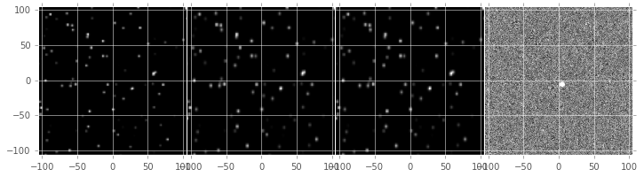
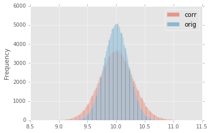
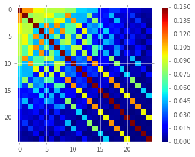
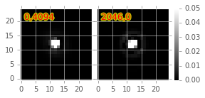

:tocdepth: 2
Implementation of Image Difference Decorrelation for LSST Transient Detection
=============================================================================

.. raw:: html

   <script type="text/javascript" src="http://cdn.mathjax.org/mathjax/latest/MathJax.js?config=default"></script>

Abstract
========

Herein, we describe a method for decorrelating image differences
produced by the `Alard & Lupton
(1998) <http://adsabs.harvard.edu/abs/1998ApJ...503..325A>`__ method of
PSF matching. Inspired by the recent work of `Zackay, et al.
(2016) <https://arxiv.org/abs/1601.02655>`__ and the prior work of
`Kaiser (2004) <#references>`__, this proposed method uses a single
post-subtraction convolution of an image difference to remove the
neighboring pixel covariances in the image difference that result from
the convolution of the template image by the PSF matching kernel. We
describe the method in detail, analyze its effects on image differences
(both real and simulated) as well as on detections and photometry of
detected sources in decorrelated image differences. We also compare the
decorrelated image differences with those resulting from a basic
implementation of `Zackay, et al.
(2016) <https://arxiv.org/abs/1601.02655>`__. We describe the
implementation of the new correction in the LSST image differencing
pipeline, and discuss potential issues and areas of future research.

1. Introduction
===============

Image subtraction analysis, also referred to as "difference image
analysis", or "DIA", is the standard method for identifying and
measuring transients and variables in astronomical images. In DIA, a
science image is subtracted from a template image (hereafter, simply,
"template"), in order to identify transients from either image. In the
LSST stack (and most other existing transient detection pipelines),
optimal image subtraction is enabled through point spread function (PSF)
matching via the method of `Alard & Lupton
(1998) <http://adsabs.harvard.edu/abs/1998ApJ...503..325A>`__ (hereafter
*A&L*) (also, `Alard,
2000 <http://aas.aanda.org/articles/aas/pdf/2000/11/ds8706.pdf%5D>`__).
This procedure is used to estimate a convolution kernel which, when
convolved with the template, matches the PSF of the template with that
of the science image by minimizing the mean squared difference between
the matched template and science image, given the assumption of no
variability between the two. The
`A&L <http://adsabs.harvard.edu/abs/1998ApJ...503..325A>`__ procedure
uses linear basis functions, with potentially spatially-varying linear
coefficients, to model the potentially spatially-varying matching kernel
which can flexibly account for spatially-varying differences in PSFs
between the two images, as well as a spatially-varying differential
background. The algorithm has the advantage that it does not require
direct measurement of the images' PSFs. Instead it only needs to model
the differential (potentially spatially-varying) matching kernel in
order to obtain an optimal subtraction. Additionally it does not require
performing a Fourier transform of the exposures; thus no issues arise
with handling masked pixels and other artifacts.

Image subtraction using the
`A&L <http://adsabs.harvard.edu/abs/1998ApJ...503..325A>`__ method
produces an optimal difference image in the case of a noise-less
template. However, when the template is noisy (*e.g.*, when the template
is comprised of a small number of co-adds), then its convolution with
the matching kernel leads to significant covariance of noise among
neighboring pixels within the resulting subtracted image, which will
adversely affect accurate detection and measurement if not accounted for
(`Slater, et al. (2016) <http://dmtn-006.lsst.io>`__; `Price & Magnier
(2004) <#references>`__). False detections in this case can be reduced
by tracking the covariance matrix, or more *ad-hoc*, increasing the
detection threshold (as is the current implementation, where detection
is performed at 5.5-\ :math:`\sigma` rather than the canonical
5.0-\ :math:`\sigma`).

While LSST will, over its ten-year span, collect dozens of observations
per field and passband, at the onset of the survey, this number will be
small enough that this issue of noisy templates will be important.
Moreover, if we intend to bin templates by airmass to account for
differential chromatic refraction (DCR), then the total number of coadds
contributing to each template will necessarily be smaller. Finally,
depending upon the flavor of coadd (`Bosch,
2016 <http://dmtn-015.lsst.io>`__) used to construct the template,
template noise and the resulting covariances in the image difference
will be more or less of an issue as the survey progresses.

In this DMTN, we describe a proposal to *decorrelate* an
`A&L <http://adsabs.harvard.edu/abs/1998ApJ...503..325A>`__ optimal
image difference. We describe its implementation in the LSST stack, and
show that it has the desired effects on the noise and covariance
properties of simulated images. Finally, we perform a similar analysis
on a set of DECam image differences, and show that this method has the
desired effects on detection rates and properties in the image
differences.

2. Proposal
===========

The goal of PSF matching via
`A&L <http://adsabs.harvard.edu/abs/1998ApJ...503..325A>`__ is to
estimate the kernel :math:`\kappa` that best matches the PSF of the two
images being subtracted, :math:`I_1` and :math:`I_2` (by minimizing
their mean squared differences; typically :math:`I_2` is the template
image, which is convolved with :math:`\kappa`). The image difference
:math:`D` is then :math:`D = I_1 - (\kappa \otimes I_2)`. More
technically, `A&L <http://adsabs.harvard.edu/abs/1998ApJ...503..325A>`__
estimates the :math:`\kappa` which minimizes the residuals in :math:`D`.
As mentioned above, due to the convolution (:math:`\kappa \otimes I_2`),
the noise in :math:`D` will be correlated. For a more complete
derivation of the expressions shown below, please see `Appendix
II. <#b-appendix-ii-derivation>`__

2.1. Difference image decorrelation.
------------------------------------

An algorithm developed by `Kaiser (2004) <#references>`__ and later
rediscovered by `Zackay, et al.
(2015) <http://arxiv.org/abs/1512.06879>`__ showed that the noise in a
PSF-matched coadd image can be decorrelated via noise whitening (i.e.
flattening the noise spectrum). The same principle may also be applied
to image differencing (`Zackay, et al.
(2016) <https://arxiv.org/abs/1601.02655>`__). In the case of
`A&L <http://adsabs.harvard.edu/abs/1998ApJ...503..325A>`__ PSF
matching, this results in an image difference in Fourier space
:math:`\widehat{D}(k)`:

*Equation 1.*
~~~~~~~~~~~~~

.. math::


   \widehat{D}(k) = \big[ \widehat{I}_1(k) - \widehat{\kappa}(k) \widehat{I}_2(k) \big] \sqrt{ \frac{ \overline{\sigma}_1^2 + \overline{\sigma}_2^2}{ \overline{\sigma}_1^2 + \widehat{\kappa}^2(k) \overline{\sigma}_2^2}}

Here, :math:`\overline{\sigma}_i^2` is the mean of the per-pixel
variances of image :math:`I_i` -- i.e.,
:math:`\overline{\sigma}_i^2 = \frac{\sum_{x,y} \sigma_i^2(x,y)}{N_{x,y}}`.
Thus, we may perform PSF matching to estimate :math:`\kappa` by standard
methods (e.g.,
`A&L <http://adsabs.harvard.edu/abs/1998ApJ...503..325A>`__ and related
methods) and then correct for the noise in the template via `Eq.
1 <#equation-1>`__. The term in the square-root of `Eq.
1 <#equation-1>`__ is a *post-subtraction convolution kernel*, or
decorrelation kernel :math:`\widehat{\phi}(k)`,

*Equation 2.*
~~~~~~~~~~~~~

.. math::


   \widehat{\phi}(k) = \sqrt{ \frac{ \overline{\sigma}_1^2 + \overline{\sigma}_2^2}{ \overline{\sigma}_1^2 + \widehat{\kappa}^2(k) \overline{\sigma}_2^2}},

which is convolved with the image difference, and has the effect of
decorrelating the noise in the image difference that was introduced by
convolution of :math:`I_2` with the
`A&L <http://adsabs.harvard.edu/abs/1998ApJ...503..325A>`__ PSF matching
kernel :math:`\kappa`. It also (explicitly) contains an extra factor of
:math:`\sqrt{\overline{\sigma}_1^2+\overline{\sigma}_2^2}`, which sets
the overall adjusted variance of the noise of the image difference (in
contrast to the unit variance set by the algorithm proposed by `Zackay,
et al. (2016) <https://arxiv.org/abs/1601.02655>`__).

2.2. Implementation details
---------------------------

Since the current implementation of
`A&L <http://adsabs.harvard.edu/abs/1998ApJ...503..325A>`__ is performed
in (real) image space, we implement the image decorrelation in image
space as well. The *post-subtraction convolution kernel*
:math:`\widehat{\phi}(k)` is computed in frequency space from
:math:`\widehat{\kappa}(k)`, :math:`\overline{\sigma}_1`, and
:math:`\overline{\sigma}_2` (`Equation 2 <#equation-2>`__), and is
inverse Fourier-transformed to a kernel :math:`\phi` in real space. The
image difference is then convolved with :math:`\phi` to obtain the
decorrelated image difference,
:math:`D^\prime = \phi \otimes \big[ I_1 - (\kappa \otimes I_2) \big]`.
This allows us to circumvent *FT*-ing the two exposures :math:`I_1` and
:math:`I_2`, which could lead to artifacts due to masked and/or bad
pixels. Finally, the resulting PSF of :math:`D^\prime`, important for
detection and measurement of ``DIA sources``, is simply the convolution
of the PSF of :math:`D` with :math:`\phi`.

2.3. Comparison of diffim decorrelation and Zackay, et al. (2016).
------------------------------------------------------------------

The decorrelation strategy described above is basically an "afterburner"
correction to the standard image differencing algorithm which has been
in wide use for over a decade. Thus it was relatively straightforward to
integrate directly into the LSST image differencing (``ip_diffim``)
pipeline. It maintains the advantages described previously that are
implicit to the
`A&L <http://adsabs.harvard.edu/abs/1998ApJ...503..325A>`__ algorithm:
the PSFs of :math:`I_1` and :math:`I_2` do not need to be measured, and
spatial variations in PSFs may be readily accounted for. The
decorrelation can be relatively inexpensive, as it requires one *FFT* of
:math:`\kappa` and one *inverse-FFT* of :math:`\widehat{\phi}(k)` (which
are both small, of order 1,000 pixels), followed by one convolution of
the difference image. Image masks are maintained, and the variance plane
in the decorrelated image difference is also adjusted to the correct
variance.

The decorrelation proposal is quite distinct from the image differencing
method proposed by `Zackay, et al.
(2016) <https://arxiv.org/abs/1601.02655>`__, which involves FFT-ing the
two input images and their PSFs. It also requires accurate measurements
of PSFs of the two images, including any bulk astrometric offsets (which
would be incorporated into the PSFs). It is not clear how information in
the images' variance planes would be propagated to the final image
difference (although theoretically, the two variance planes could simply
be added).

Of note, the `Zackay, et al.
(2016) <https://arxiv.org/abs/1601.02655>`__ procedure is symmetric in
:math:`I_1` and :math:`I_2` (e.g., it does not explicitly require
:math:`I_1` to have a broader PSF than :math:`I_2`), whereas the
standard `A&L <http://adsabs.harvard.edu/abs/1998ApJ...503..325A>`__ is
not. (Deconvolution of the template, or "pre-convolution" of the science
image are possible methods to address this concern with
`A&L <http://adsabs.harvard.edu/abs/1998ApJ...503..325A>`__.) It was
also claimed by the authors that the `Zackay, et al.
(2016) <https://arxiv.org/abs/1601.02655>`__ procedure produces cleaner
image subtractions in cases of (1) perpendicular-oriented PSFs and (2)
astrometric jitter. This claim has yet to be investigated thoroughly
using the LSST
`A&L <http://adsabs.harvard.edu/abs/1998ApJ...503..325A>`__
implementation.

3. Results
==========

3.1 Simulated image differences.
--------------------------------

We developed a simple reference implementation of
`A&L <http://adsabs.harvard.edu/abs/1998ApJ...503..325A>`__, and applied
it to simulated images with point-sources with a variety of
signal-to-noise, and different (elliptical) Gaussian PSFs and (constant)
image variances. We included the capability to simulate spatial PSF
variation, including spatially-varying astrometric offsets (which can be
modeled by the
`A&L <http://adsabs.harvard.edu/abs/1998ApJ...503..325A>`__ PSF matching
kernel). An example input template and science image, as well as
PSF-matched template and resulting *diffim* is shown in `Figure
1 <#figure-1>`__.



   From left to right, sample (simulated) template image, PSF-matched
   template, science image, and difference image. In this simulated
   example, the source near the center was set to increase in flux by 2%
   between the science and template images.

In `Figure 2 <#figure-2>`__, we show the PSF matching kernel
(:math:`\kappa`) that was estimated for the images shown in `Figure
1 <#figure-1>`__, and the resulting decorrelation kernel, :math:`\phi`.
We note that :math:`\phi` largely has the structure of a delta function,
with a small region of negative signal, thus its capability, when
convolved with the difference image, to act effectively as a
"sharpening" kernel.

.. figure:: _static/img1.png
   :name: 

.. figure:: _static/img2.png
   :name: figure-2

   Sample PSF matching kernel :math:`\kappa` (left) and resulting
   decorrelation kernel :math:`\phi` (right) for the images shown in
   `Figure 1 <#figure-1>`__.

When we convolve :math:`\phi` (`Figure 2 <#figure-2>`__, right panel)
with the raw image difference (`Figure 1 <#figure-1>`__, right-most
panel), we obtain the decorrelated image, shown in the left-most panel
of `Figure 3 <#figure-3>`__. The noise visually appears to be greater in
the decorrelated image, and a closer look at the statistics reveals that
this is indeed the case (`Table 1 <#table-1>`__, `Figure
4 <#figure-4>`__ and `Figure 5 <#figure-5>`__). `Figure 4 <#figure-4>`__
shows that the variance of the decorrelated image has increased. Indeed,
the measured variances (`Table 1 <#table-1>`__) reveal that the variance
of the uncorrected image difference was lower than expected, while the
decorrelation has increased the variance to the expected level:

+-------------------------+----------------------+--------------+
|                         | Variance             | Covariance   |
+=========================+======================+==============+
| Corrected               | 0.0778               | 0.300        |
+-------------------------+----------------------+--------------+
| Original                | 0.0449               | 0.793        |
+-------------------------+----------------------+--------------+
| Expected                | 0.0800               | 0.004        |
+-------------------------+----------------------+--------------+
| Zackay, et al. (2016)   | 0.0790\ :math:`^*`   | 0.301        |
+-------------------------+----------------------+--------------+

 Table 1. Image difference statistics. Variances and neighbor-pixel covariances for image differences derived from two images each with input Gaussian noise with a standard deviation of 0.2 (variance of 0.04). :math:`^*`\ Note that the `Zackay, et al. (2016) <https://arxiv.org/abs/1601.02655>`__ procedure intrinsically normalizes the image difference to have unit variance; we have adjusted it to have the same scaling as our method. The measure of covariance is actually the sum of off-diagonal terms divided by the sum of the diagonal terms (and should equal 0 for a perfectly diagonal matrix).
~~~~~~~~~~~~~~~~~~~~~~~~~~~~~~~~~~~~~~~~~~~~~~~~~~~~~~~~~~~~~~~~~~~~~~~~~~~~~~~~~~~~~~~~~~~~~~~~~~~~~~~~~~~~~~~~~~~~~~~~~~~~~~~~~~~~~~~~~~~~~~~~~~~~~~~~~~~~~~~~~~~~~~~~~~~~~~~~~~~~~~~~~~~~~~~~~~~~~~~~~~~~~~~~~~~~~~~~~~~~~~~~~~~~~~~~~~~~~~~~~~~~~~~~~~~~~~~~~~~~~~~~~~~~~~~~~~~~~~~~~~~~~~~~~~~~~~~~~~~~~~~~~~~~~~~~~~~~~~~~~~~~~~~~~~~~~~~~~~~~~~~~~~~~~~~~~~~~~~~~~~~~~~~~~~~~~~~~~~~~~~~~~~~~~~~~~~~~~~~~~~~~~~~~~~~~~~~~~~~~~~~~~~~~~~~~~~~~~~~~~~~~~~~~~~~~~~~~~~~~~~~~~~~~~~~~~~~~~~~~~~~~~~~~~~~~~~~~~~~~~~~~~~~~~~~~~~~~~~~~~~~~~~~~~~~~~~~~~~~~~~~~~~~~~~~~~~~~~~~~~~~~~~~~~~~~~~~~~~~~~~~~~~~~~~~~~~~~~~

.. raw:: html

   <!--
   ```python
   %In [1]:
   print sig1, sig2  # Input std. deviation of template and science images
   print 'Corrected:', np.mean(diffim2), np.std(diffim2)
   print 'Original: ', np.mean(diffim1), np.std(diffim1)
   print 'Expected: ', np.sqrt(sig1**2 + sig2**2)
   %Out [1]:
   0.2 0.2
   Corrected: 10.0042330181 0.293237231242
   Original:  9.99913482654 0.211891941431
   Expected:  0.282842712475
   ```
   -->

In addition, we see (`Table 1 <#table-1>`__ and `Figure
5 <#figure-5>`__) that the covariances between neighboring pixels in the
image difference has been significantly decreased following convolution
with the decorrelation kernel. The covariance matrix has been
significantly diagonalized. While the covariance of the decorrelated
image might at first glance appear high relative to the random
expectation, we show (below) that it is equal to the value obtained
using a basic implementation of the `Zackay, et al.
(2016) <https://arxiv.org/abs/1601.02655>`__ "proper" image subtraction
procedure.

.. raw:: html

   <!--
   ```python
   %In [2]:
   print np.nansum(cov2)/np.sum(np.diag(cov2))  # cov2 is the covar. matrix of the corrected image.
   print np.nansum(cov1)/np.sum(np.diag(cov1))  # cov1 is the covar. matrix of the uncorrected image.
   %Out [2]:
   0.300482626371
   0.793176605206
   ```
   -->

.. figure:: _static/img3.png
   :name: figure-3

   On the left is the decorrelated image difference, :math:`D^\prime`.
   Original image difference :math:`D` is shown here for comparison, in
   the right-most panel, with the same intensity scale, as well as in
   `Figure 1 <#figure-1>`__.



   Histogram of sigma-clipped pixels in the original image difference\*
   :math:`D` (blue; 'orig') and the decorrelated image difference
   :math:`D^\prime` (red; 'corr') in `Figure 3 <#figure-3>`__.



.. figure:: _static/img6.png
   :name: figure-5

   Covariance between neighboring pixels in the original, uncorrected
   image difference :math:`D` (left) and the decorrelated image
   difference :math:`D^\prime` (right) in `Figure 3 <#figure-3>`__.

3.2. Comparison with Zackay, et al. (2016).
-------------------------------------------

We developed a basic implementation of the `Zackay, et al.
(2016) <https://arxiv.org/abs/1601.02655>`__ "proper" image differencing
procedure in order to compare image differences (see `Appendix III. for
details <#c-appendix-iii-implementation-of-basic-zackay-et-al-2016-algorithm>`__).

As shown in `Table 1 <#table-1-image-difference-statistics>`__, many of
the bulk statistics between image differences derived via the two
methods are (as expected) nearly identical. In fact, the two "optimal"
image differences are nearly identical, as we show in `Figure
6 <#figure-6>`__. The variance of the difference between the two
difference images is of the order of 0.05% of the variances of the
individual images.

.. figure:: _static/img7.png
   :name: figure-6

   Histogram of pixel-wise difference between optimal image differences.
   Each image difference has been rescaled to unit variance to
   facilitate differencing.

3.3. Application to real data.
------------------------------

We have implemented and tested the proposed decorrelation method in the
LSST software stack as a new ``lsst.pipe.base.Task`` subclass called
``lsst.ip.diffim.DecorrelateALKernelTask``, and applied it to real data
obtained from DECam. For this image differencing experiment, we used the
standard `A&L <http://adsabs.harvard.edu/abs/1998ApJ...503..325A>`__
procedure with a spatially-varying PSF matching kernel (default
configuration parameters). The decorrelation computation may be turned
on by setting the option ``doDecorrelation=True`` for the
``imageDifference.py`` command-line task. In `Figure 7 <#figure-7>`__ we
show sub-images of two astrometrically aligned input exposures, the
PSF-matched template image, and the decorrelated image difference.

.. figure:: _static/img8.png
   :name: figure-7

   Image differencing on real (DECam) data. Sub-images of the two input
   exposures (top; template has been astrometrically aligned with the
   science image), the PSF-matched template (bottom-left), and the
   decorrelated image difference (bottom-right).

``DecorrelateALKernelTask`` simply extracts the
`A&L <http://adsabs.harvard.edu/abs/1998ApJ...503..325A>`__ PSF matching
kernel :math:`\kappa` estimated previously by
``lsst.ip.diffim.ImagePsfMatchTask.subtractExposures()`` for the center
of the image, and estimates a constant image variance
:math:`\overline{\sigma}_1^2` and :math:`\overline{\sigma}_2^2` for each
image (sigma-clipped mean of its variance plane; in this example 62.8
and 60.0 for the science and template images, respectively). The task
then computes the decorrelation kernel :math:`\phi` from those three
quantities (`Figure 8 <#figure-8>`__). As expected, the resulting
decorrelated image difference has a greater variance than the
"uncorrected" image difference (120.8 vs. 66.8), and a value close to
the naive expected variance :math:`60.0+62.8=122.8`. Additionally, we
show in `Figure 9 <#figure-9>`__ that the decorrelated DECam image
indeed has a lower neighboring-pixel covariance (6.0% off-diagonal
covariance, vs. 35% for the uncorrected diffim).



.. figure:: _static/img10.png
   :name: figure-8

   Image differencing on real (DECam) data. PSF matching kernels (left)
   and corresponding decorrelation kernels (right). Shown are kernels
   derived from two corners of the image which showed the greatest
   variation in the matching kernels (pixel coordinates overlaid).

.. figure:: _static/img11.png
   :name: figure-9

   Image differencing on real (DECam) data. Neighboring pixel covariance
   matrices for uncorrected (left) and corrected (right) image
   difference.

3.4. Effects of diffim decorrelation on detection and measurement
-----------------------------------------------------------------

See `this
notebook <https://github.com/lsst-dm/diffimTests/blob/master/20.%20compare%20photometry-corrected-many-DECam-images.ipynb>`__.

The higher variance of the decorrelated image difference results in a
smaller number of ``DIA source`` detections (:math:`\sim` 70% fewer) at
the same default (5.5-:math:`\sigma`) detection threshold (`Table
2 <#table-2>`__). Notably, if we decrease the detection threshold to the
desired 5.0-\ :math:`\sigma` level, the detection count in the
decorrelated image difference does not increase substantially
(:math:`\sim 14\%`). However, the number of detections does increase
dramatically (:math:`\sim 176\%`) for the uncorrected image difference
if we were to switch to a 5.0-\ :math:`\sigma` detection threshold.
(This is why the default ``DIA source`` detection threshold has
previously been set in the LSST stack to 5.5-\ :math:`\sigma`).

+------------------+------------------+--------------+--------------+----------------+
| Decorrelated?    | Detection        | Positive     | Negative     | Merged         |
|                  | threshold        | detected     | detected     | detected       |
+==================+==================+==============+==============+================+
| Yes              | 5.0              | 43           | 18           | 50             |
+------------------+------------------+--------------+--------------+----------------+
| Yes              | 5.5              | 35           | 15           | 41             |
+------------------+------------------+--------------+--------------+----------------+
| No               | 5.0              | 89           | 328          | 395            |
+------------------+------------------+--------------+--------------+----------------+
| No               | 5.5              | 58           | 98           | 143            |
+------------------+------------------+--------------+--------------+----------------+

 Table 2. Comparison of numbers of DIA sources detected in DECam image difference run with decorrelation turned on or off, and with a 5.5-\ :math:`\sigma` or 5.0-\ :math:`\sigma` detection threshold.
~~~~~~~~~~~~~~~~~~~~~~~~~~~~~~~~~~~~~~~~~~~~~~~~~~~~~~~~~~~~~~~~~~~~~~~~~~~~~~~~~~~~~~~~~~~~~~~~~~~~~~~~~~~~~~~~~~~~~~~~~~~~~~~~~~~~~~~~~~~~~~~~~~~~~~~~~~~~~~~~~~~~~~~~~~~~~~~~~~~~~~~~~~~~~~~~~~~~~~~

We matched the catalogs of detections between the uncorrected
("undecorrelated") and decorrelated image differences (to within
:math:`5^{\prime\prime}`), and found that 45 of the 47 ``DIA sources``
detected in the decorrelated image are also detected in the uncorrected
image difference. We compared the aperture photometry of the 45 matched
``DIA sources`` in the two catalogs (using the
``base_CircularApertureFlux_50_0_flux`` measurement) using a linear
regression to quantify any differential offset and scaling. (We did not
filter to remove dipoles, as the ``DipoleClassification`` task is still
a work in progress and doing so would remove a large number of
``DIA sources``. We found that there is no significant photometric
offset between measurements in the two images, while the flux
measurement is :math:`\sim 4.5 \pm 0.5\%` lower in the decorrelated
image. Unsurprisingly, the quantified errors in the flux measurements
(``base_CircularApertureFlux_50_0_fluxSigma``) are
:math:`\sim 120 \pm 5\%` greater in the decorrelated image.

For a more thorough analysis, we recapitulated some of the work of
`Slater, et al. (2016) <http://dmtn-006.lsst.io>`__, which described the
issue with per-pixel covariance in
`A&L <http://adsabs.harvard.edu/abs/1998ApJ...503..325A>`__ image
differences generated by the LSST stack and the resulting issues with
detection and measurement, but this time using the decorrelated image
differences. With the help of Dr. Slater, we performed exactly his
analysis on the same set of DECam images as described in `Slater, et al.
(2016) <http://dmtn-006.lsst.io>`__. In `Figure 10 <#figure-10>`__
below, we present an updated version of `Figure 6 from Slater, et al.
(2016) <http://dmtn-006.lsst.io/#forcephot-sci-template-v197367>`__
after decorrelation has been performed. We also present in `Figure
11 <#figure-11>`__ a version of `Figure 7 from Slater, et al.
(2016) <http://dmtn-006.lsst.io/#forcephot-hists>`__. Our analysis shows
that the detections in the decorrelated image difference are now nicely
tracking just at or above the :math:`5\sigma` threshold.

.. figure:: _static/fig_10b.png
   :name: figure-10

   As in Figure 6 from `Slater, et al.
   (2016) <http://dmtn-006.lsst.io/#forcephot-sci-template-v197367>`__:
   PSF photometry in the template and science exposures, forced on the
   positions of DIA source detections in the image difference following
   image difference decorrelation. The parallel diagonal lines denote
   science−template\* :math:`>5\sqrt{2}\sigma` and science−template
   :math:`< 5\sqrt{2}\sigma`, which are the intended criteria for
   detection. The numerous detections just at or below these detection
   thresholds have been eliminated, and (ignoring the two clouds of
   detections near (0, 0) and (-2.5, 2.5)) the primary detections are
   above (or below) the detection thresholds. Sources have not been
   filtered to remove false detections (e.g., dipoles).


   As in Figure 7 from `Slater, et al.
   (2016) <http://dmtn-006.lsst.io//#forcephot-hists>`__: Comparison of
   force photometry SNR (red) versus the SNR in image difference (blue)
   for all sources in a single DECam exposure. The black line shows the
   expected detection counts from random noise (`Slater, et al.
   (2016) <http://dmtn-006.lsst.io/>`__). The left figure is for
   uncorrected image difference (identical to `Slater, et al.
   (2016) <http://dmtn-006.lsst.io//#forcephot-hists>`__). The right is
   the same but for sources detected at\* 5-\ :math:`\sigma` \*in the
   decorrelated image difference.

4. Conclusions and future work
==============================

We have shown that performing image difference decorrelation as an
"afterburner" post-processing step to
`A&L <http://adsabs.harvard.edu/abs/1998ApJ...503..325A>`__ image
differences generated by the LSST stack is an effective method to
eliminate most issues arising from the resulting per-pixel covariance in
said images. We also showed that the resulting decorrelated image
differences have similar statistical and noise properties to those
generated using the "proper image subtraction" method recently proposed
by `Zackay, et al. (2016) <https://arxiv.org/abs/1601.02655>`__.

There still exist several outstanding issues or questions related to
details of the decorrelation procedure as it is currently implemented in
the LSST stack. We now describe several of those.

4.1. Accounting for spatial variations in noise (variance) and matching kernel
------------------------------------------------------------------------------

There will be spatial variations across an image of the PSF matching
kernel and the template- and science-image per-pixel variances (an
example of the kernel variation is shown in `Figure 8 <#figure-8>`__).
These three parameters separately will contribute to spatial variations
in the decorrelation kernel :math:`\phi`, with unknown resulting
second-order effects on the resulting decorrelated image. If these
parameters are computed just for the center of the images (as they are,
currently), then the resulting :math:`\phi` is only accurate for the
center of the image, and could lead to over/under-correction of the
correlated noise nearer to the edges of the image difference. Another
effect is that the resulting adjusted image difference PSF will also not
include the accurate spatial variations.

We explored the effect of spatial variations in all three of these
parameters for a single example DECam CCD image subtraction. The PSF
matching kernel for this image varies across the image (`Figure
8 <#figure-8>`__), and thus so does the resulting decorrelation kernel,
:math:`\phi`. Additionally, the noise (quantified in the variance planes
of the two exposures) varies across both the template and science images
by :math:`\sim 1\%` (data not shown here, but see `this IPython
notebook <https://github.com/lsst-dm/diffimTests/blob/master/19.%20check%20variance%20planes.ipynb>`__).
We computed decorrelation kernels :math:`\phi_i` for the observed
extremes of each of these three parameters, and compared the resulting
decorrelated image differences to the canonical decorrelated image
difference derived using :math:`\phi` computed for the center of the
images. The distribution of variances (sigma-clipped means of the
variance plane) of the resulting decorrelated image differences differed
by as much as :math:`\sim 5.6\%` at the extreme (:math:`\sim 1.3\%`
standard deviation). The per-pixel covariance in the resulting images
varied by as much as :math:`\sim 50\%` (between :math:`4.0` and
:math:`8.0\%`) at the extreme (:math:`\sim 25\%` standard deviation) but
all represented significant reductions from :math:`34.9\%` in the
uncorrected image difference. Finally, the number of detections on the
image differences varied by :math:`10\%` at the extremes (:math:`2.2\%`
standard deviation) around :math:`\sim 50` detections total. We have yet
to investigate DIA source measurement, which could be affected by the
assumption of a constant PSF across the image difference.

We have not determined whether this uncertainty in image difference
statistics arising from using a single (constant) decorrelation kernel
and constant image variances for diffim decorrelation will have a
significant effect on LSST alert generation. It is clearly at most a
second-order effect, with measurable uncertainties of order a few
percent at most. If this uncertainty is deemed to high, then we will
need to investigate computing :math:`\phi` on a grid across the image,
and (ideally) perform an interpolation to estimate a spatially-varying
:math:`\phi(x,y)`.

4.2. DIA Source measurement
---------------------------

The measurement and classification of dipoles in image differences,
described in `Reiss (2016) <http://dmtn-007.lsst.io>`__ is complicated
by image difference decorrelation, because dipole fitting is constrained
using signal from the "pre-subtraction" template and science images, as
well as the difference image. The prior assumption (for uncorrected
image differences) has been that the PSF of the difference image is
identical to those of the science and pre-PSF-matched template images,
and thus the science image :math:`I_1` could be reconstructed from the
difference image :math:`D` plus the PSF-matched template image
:math:`(\kappa \otimes I_2)`:

.. math::


   I_1 = D + (\kappa \otimes I_2).

The decorrelation process modifies the PSF of the image difference such
that this equivalency no longer holds, and the PSFs of the three images
are now different. We will need to update the ``DipoleFitTask`` to
accurately model dipoles across the three images. However now that the
noise is accurately represented in the variance plane of the
decorrelated image difference, dipole measurement should be more
accurate and covariances will not be a concern.

5. Appendix
===========

5.A. Appendix I. Technical considerations.
------------------------------------------

1. A complication arises in deriving the decorrelation kernel, in that
   the kernel starts-off with odd-sized pixel dimensions, but must be
   even-sized for FFT. Then once it is inverse-FFT-ed, it must be
   re-shaped to odd-sized again for convolution. This must be done with
   care to avoid small shifts in the pixels of the resulting
   decorrelated image difference.

2. Should we use the original (unwarped) template to compute the
   variance :math:`\sigma_2` that enters into the computation of the
   decorrelation kernel, or should we use the warped template? The
   current implementation uses the warped template. This should not
   matter so long as we know that the variance plane gets handled
   correctly by the warping procedure.

5.B. Appendix II. Derivation
----------------------------

Starting with the
`A&L <http://adsabs.harvard.edu/abs/1998ApJ...503..325A>`__ expression,

.. math::


   D = I_1 - (\kappa \otimes I_2),

where :math:`I_1` is the science image with PSF :math:`\phi_1`. The
model is that the true sky scene :math:`D` is convolved with
:math:`\phi_1`, so if we assume Gaussian, heteroschedastic noise (sky
noise-limited), take a Fourier Transform, and compute the
log-likelihood, we obtain

.. math::


   ln~\mathcal{L} = \sum_k{\frac{(I_1(k)-\kappa(k)I_2(k)-D(k)\phi_1(k))^2}{\overline\sigma^2_1+\kappa^2(k)\overline{\sigma}^2_2}}.

Then the MLE for :math:`D(k)` is

.. math::


   \hat{D}(k) = \frac{I_1(k)-\kappa(k)I_2(k)}{\phi_1(k)},

with variance

.. math::


   \mathrm{Var}(\hat{D}(k)) = \frac{\overline\sigma^2_1+\kappa^2(k)\overline\sigma^2_2}{\phi^2_1(k)}.

The variance diverges at large :math:`k` as :math:`\phi_1^2(k)`
approaches zero, but (as shown by `Kaiser (2004) <#references>`__ and
`Zackay, et al. (2016) <https://arxiv.org/abs/1601.02655>`__) we can
flatten the spectrum ("whiten the noise") to obtain the expression in
`Equation 1 <#equation-1$>`__, which we will repeat here:

.. math::


   D(k) = \big[ I_1(k) - \kappa(k) I_2(k) \big] \sqrt{ \frac{ \overline{\sigma}_1^2 + \overline{\sigma}_2^2}{ \overline{\sigma}_1^2 + \kappa^2(k) \overline{\sigma}_2^2}}

To compare this calculation to the `Zackay, et al.
(2016) <https://arxiv.org/abs/1601.02655>`__ "proper image subtraction"
expression, we take the `Zackay, et al.
(2016) <https://arxiv.org/abs/1601.02655>`__ assumption that
:math:`\phi_1` and :math:`\phi_2` are known, and thus
:math:`\kappa(k)=\phi_1(k)/\phi_2(k)`. Substituting this into `Equation
1 <#equation-1>`__ gives us:

.. math::


   D(k) = \big[ \phi_2(k)I_1(k) - \phi_1(k) I_2(k) \big] \sqrt{ \frac{ \overline{\sigma}_1^2 + \overline{\sigma}_2^2}{ \overline{\sigma}_1^2\phi_2^2(k) + \overline{\sigma}_2^2\phi_1^2(k)}},

which is identical to Equation (13) in `Zackay, et al.
(2016) <https://arxiv.org/abs/1601.02655>`__ (`Equation
3 <#equation-3>`__ below), except for an additional factor
:math:`\sqrt{\overline{\sigma}_1^2 + \overline{\sigma}_2^2}`.

5.C. Appendix III. Implementation of basic Zackay et al. (2016) algorithm.
--------------------------------------------------------------------------

We applied the basic `Zackay, et al.
(2016) <https://arxiv.org/abs/1601.02655>`__ procedure only to a set of
small, simulated images. Our implementation simply applies Equation (14)
of `their manuscript <https://arxiv.org/abs/1601.02655>`__ to the two
simulated reference (:math:`R`) and "new" (:math:`N`) images, providing
their (known) PSFs :math:`P_r`, :math:`P_n` and variances
:math:`\sigma_r^2`, :math:`\sigma_n^2`\ as to derive the proper
difference image :math:`D`:

Equation 3.
~~~~~~~~~~~

.. math::


   \widehat{D} = \frac{F_r\widehat{P_r}\widehat{N} - F_n\widehat{P_n}\widehat{R}}{\sqrt{\sigma_n^2 F_r^2 \left|\widehat{P_r}\right|^2 + \sigma_r^2 F_n^2 \left|\widehat{P_n}\right|^2}}.

Here, :math:`F_r` and :math:`F_n` are the images' flux-based zero-points
(which we will set to one here), and :math:`\widehat{D}` denotes the FT
of :math:`D`. This expression is in Fourier space, and we inverse-FFT
the image difference :math:`\widehat{D}` to obtain the final image
:math:`D`.

.. code:: python

    def performZackay(R, N, P_r, P_n, sig1, sig2):
        from scipy.fftpack import fft2, ifft2, ifftshift

        F_r = F_n = 1.  # Don't worry about flux scaling here.
        P_r_hat = fft2(P_r)
        P_n_hat = fft2(P_n)
        d_hat_numerator = (F_r * P_r_hat * fft2(N) - F_n * P_n_hat * fft2(R))
        d_hat_denom = np.sqrt((sig1**2 * F_r**2 * np.abs(P_r_hat)**2) + (sig2**2 * F_n**2 * np.abs(P_n_hat)**2))
        d_hat = d_hat_numerator / d_hat_denom

        d = ifft2(d_hat)
        D = ifftshift(d.real)
        return D

5.D. Appendix IV. Notebooks and code
------------------------------------

All figures in this document were generated using IPython notebooks and
associated code in `the diffimTests github
repository <https://github.com/lsst-dm/diffimTests>`__, in particular,
notebooks numbered
`14 <https://github.com/lsst-dm/diffimTests/blob/master/14.%20Test%20Lupton(ZOGY)%20post%20convolution%20kernel%20on%20simulated%20(noisy)%202-D%20data%20with%20a%20variable%20source-updated.ipynb>`__,
`13 <https://github.com/lsst-dm/diffimTests/blob/master/13.%20compare%20L(ZOGY)%20and%20ZOGY%20diffims%20and%20PSFs.ipynb>`__,
`17 <https://github.com/lsst-dm/diffimTests/blob/master/17.%20Do%20it%20in%20the%20stack%20with%20real%20data.ipynb>`__,
`19 <https://github.com/lsst-dm/diffimTests/blob/master/19.%20check%20variance%20planes.ipynb>`__,
and
`20 <https://github.com/lsst-dm/diffimTests/blob/master/20.%20compare%20photometry.ipynb>`__.

The decorrelation procedure described in this technote are implemented
in the ``ip_diffim`` and ``pipe_tasks`` LSST Github repos.

6. Acknowledgements
===================

We would like to thank C. Slater for re-running his DECam image analysis
scripts using the new decorrelation code in the stack.

7. References
=============

Details on references to unpublished works:

1. Kaiser (2004), PSDC-002-01[01]-00: Addition of Images with Varying
   Seeing
2. Price & Magnier (2004), “Pan-STARRS Image Processing Pipeline:
   PSF-Matching for Subtraction and Stacking”
