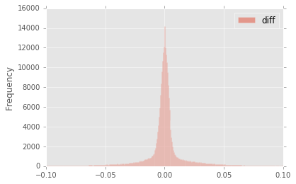
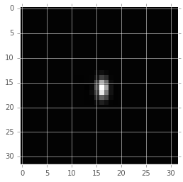
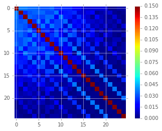

:tocdepth: 2
Implementation of Image Difference Decorrelation
================================================

.. raw:: html

   <script type="text/javascript" src="http://cdn.mathjax.org/mathjax/latest/MathJax.js?config=default"></script>

0. Abstract
===========

Herein, we describe ...

1. Introduction
===============

The standard method for PSF matching for image subtraction in the LSST
software stack is the method of `Alard & Lupton
(1998) <http://adsabs.harvard.edu/abs/1998ApJ...503..325A>`__ (hereafter
*A&L*) (also, `Alard,
2000 <http://aas.aanda.org/articles/aas/pdf/2000/11/ds8706.pdf]>`__).
This procedure is used to estimate a convolution kernel which, when
convolved with the template image, matches the PSF of the template image
with that of the science image, enabling a clean subtraction. Due to its
use of linear basis functions to model the matching kernel, the method
can flexibly incorporate spatially-varying PSFs (i.e., via a
spatially-varying matching kernel), as well as a spatially-varying
differential background. The algorithm has the advantage that it does
not require measurement of the images' PSFs. Instead it only needs to
model the differential (potentially spatially-varying) matching kernel
in order to obtain an optimal subtraction.

Image subtraction using the
`A&L <http://adsabs.harvard.edu/abs/1998ApJ...503..325A>`__ method
produces an optimal difference image in the case of a noise-less
template. However, when the template is noisy (*e.g.*, when the template
is comprised of a small number of co-adds), then its convolution with
the matching kernel leads to significant covariance of neighboring
pixels within the subtracted image, which will affect detection and
measurement if not accounted for (`Slater, et al.
(2016) <http://dmtn-006.lsst.io>`__; `Price & Magnier
(2004) <Pan-STARRS%20Image%20Processing%20Pipeline:%20PSF-Matching%20for%20Subtraction%20and%20Stacking>`__).
False detections in this case can be reduced by tracking the covariance
matrix, or more *ad-hoc* (as is the current implementation) increasing
the detection threshold.

While LSST will, over its ten-year span, collect dozens of observations
per field and passband, at the onset of the survey, this number will be
small enough that this issue of noisy templates will be important.
Moreover, if we inted to bin templates by airmass to account for
differential chromatic refraction (DCR), then the total number of coadds
contributing to each template will necesserily be smaller. Finally,
depending upon the flavor of coadd (`Bosch,
2016 <http://dmtn-015.lsst.io>`__) used to construct the template,
template noise and the resulting covariances in the image difference
will be more or less of an issue as the survey progresses.

2. Proposal
===========

The goal of PSF matching via
`A&L <http://adsabs.harvard.edu/abs/1998ApJ...503..325A>`__ is to
estimate the PSF matching kernel :math:`\kappa` that best matches the
PSF of the two images being subtracted, :math:`I_1` and :math:`I_2`
(typically :math:`I_2` is the template image, which is convolved with
the PSF matching kernel :math:`\kappa`). The image difference :math:`D`
is then :math:`D = I_1 - (\kappa \otimes I_2)`. As mentioned above, due
to the convolution (:math:`\kappa  \otimes I_2`), the noise in :math:`D`
will be correlated.

2.1. Difference image decorrelation.
------------------------------------

An algorithm developed by `Kaiser
(2001) <Addition%20of%20Images%20with%20Varying%20Seeing.%20PSDC-002-011-xx>`__
and later rediscovered by `Zackay, et al
(2015) <https://arxiv.org/abs/1512.06879>`__ showed that the noise in a
PSF-matched coadd image can be decorrelated via noise whitening (i.e.
flattening the noise spectrum). The same principle may also be applied
to image differencing (`Zackay, et al.
(2016) <https://arxiv.org/abs/1601.02655>`__). In the case of
`A&L <http://adsabs.harvard.edu/abs/1998ApJ...503..325A>`__ - based PSF
matching, this results in an image difference in Fourier space
:math:`\widehat{D}(k)`:

.. math::


   \widehat{D}(k) = \big[ \widehat{I}_1(k) - \widehat{\kappa}(k) \widehat{I}_2(k) \big] \sqrt{ \frac{ \sigma_1^2 + \sigma_2^2}{ \sigma_1^2 + \widehat{\kappa}^2(k) \sigma_2^2}}

Equation 1.
           

Here, :math:`\sigma_1^2` and :math:`\sigma_2^2` are the variances of
images :math:`I_1` and :math:`I_2`, respectively. Thus, we may perform
PSF matching to estimate :math:`\kappa` by standard methods (e.g.,
`A&L <http://adsabs.harvard.edu/abs/1998ApJ...503..325A>`__ and related
methods) and then correct for the noise in the template via `Eq.
1 <#equation-1>`__. The term in the square-root of `Eq.
1 <#equation-1>`__ is a *post-subtraction convolution kernel*
:math:`\widehat{\phi}(k)`, which, when convolved with the image
difference, has the effect of decorrelating the noise in the image
difference. It also (explicitly) contains an extra factor of
:math:`\sqrt{\sigma_1^2+\sigma_2^2}`, which sets the overall adjusted
variance of the noise of the image difference (rather than the unit
variance set vy the Zackat et al. algorithm). This strategy maintains
the advantages described previously: the PSFs of :math:`I_1` and
:math:`I_2` do not need to be measured, and spatial variations in PSFs
may be readily accounted for (although see below). The decorrelation can
be relatively inexpensive, as it requires (at least) one *FFT* of
:math:`\kappa` and *iFFT* of :math:`\widehat{\phi}(k)` (which are both
small, of the order 1,000 pixels), followed by one convolution of the
difference image.

3. Implementation details
=========================

Since the current implementation of
`A&L <http://adsabs.harvard.edu/abs/1998ApJ...503..325A>`__ is performed
in image space, we chose to implement the image decorrelation in image
space as well. The *post-subtraction convolution kernel*
:math:`\widehat{\phi}(k)` is then computed in frequency space from
:math:`\widehat{\kappa}(k)`, :math:`\sigma_1`, and :math:`\sigma_2`, and
is then inverse Fourier-transformed to a kernel :math:`\phi` in real
space. The image difference is then convolved with :math:`\phi` to
obtain the decorrelated image difference,
:math:`D^\prime = \phi \otimes \big[ I_1 - (\kappa \otimes I_2) \big]`.
This also allows us to circumvent *FT*-ing the two exposures :math:`I_1`
and :math:`I_2`, which could lead to artifacts due to masked and/or bad
pixels.

4. Results
==========

4.1 Simulated image differences.
--------------------------------

We have developed a simple reference implementation of
`A&L <http://adsabs.harvard.edu/abs/1998ApJ...503..325A>`__, and applied
it to simulated images with point-sources with a variety of
signal-to-noise, and different Gaussian PSFs and image variances. We
included the capability to simulate spatial PSF variation, including
spatially-varying astrometric offsets (which can be incorporated into
the `A&L <http://adsabs.harvard.edu/abs/1998ApJ...503..325A>`__ PSF
matching kernel). An example input template and science image, as well
as PSF-matched template and resulting *diffim* is shown in `Figure
1 <#figure-1-image-differencing>`__.

.. figure:: _static/img0.png
   :alt: 

*Figure 1. Image differencing.*
                               

*From left to right, sample (simulated) template image, PSF-matched
template, science image, and difference image. In this simulated
example, the source near the center was set to increase in flux by 2%
between the science and template "exposures."*

In `Figure 2 <#figure-2-kernels>`__, we show the PSF matching kernel
(:math:`\kappa`) that was estimated for the images shown in `Figure
1 <#figure-1-image-differencing>`__, and the resulting decorrelation
kernel, :math:`\phi`. We note that :math:`\phi` largely has the
structure of a delta function, with a small region of negative signal,
thus its capability, when convolved with the difference image, to act as
an effective "sharpening" kernel.

|Matching kernel| |Correction kernel|

*Figure 2. Kernels.*
                    

*Sample PSF matching kernel* :math:`\kappa` *(left) and resulting
decorrelation kernel,* :math:`\phi` *for the images shown in* `Figure
1 <#figure-1-image-differencing>`__.

When we convolve :math:`\phi` (`Figure 2 <#figure-2-kernels>`__, right
panel) with the raw image difference (`Figure
1 <#figure-1-image-differencing>`__, right-most panel), we obtain the
decorrelated image, shown in the left-most panel of `Figure
3 <#figure-3-decorrelated-diffim>`__. While the noise visually appears
to be greater in the decorrelated image, a closer look at the statistics
reveals that this is indeed the case (`Table
1 <#table-1-image-difference-statistics>`__, `Figure
4 <#figure-4-decorrelated-image-statistics>`__ and `Figure
5 <#figure-5-covariance-matrices>`__). `Table
1 <#table-1-image-difference-statistics>`__ and `Figure
4 <#figure-4-decorrelated-image-statistics>`__ show that the variance of
the decorrelated image has increased. Indeed, the measured variances
reveal that the variance of the uncorrected image difference was lower
than expected, while the decorrelation has increased the variance to the
expected level:

+-------------------------+---------------------+--------------+
|                         | Variance            | Covariance   |
+=========================+=====================+==============+
| Corrected               | 0.0778              | 0.300        |
+-------------------------+---------------------+--------------+
| Original                | 0.0449              | 0.793        |
+-------------------------+---------------------+--------------+
| Expected                | 0.0800              | 0.004        |
+-------------------------+---------------------+--------------+
| Zackay, et al. (2016)   | 0.987\ :math:`^*`   | 0.301        |
+-------------------------+---------------------+--------------+

*Table 1. Image difference statistics.*
                                       

*Variances and neighbor-pixel covariances for image differences derived
from two images each with input variances of 0.2.* :math:`^*` *Note that
the* `Zackay, et al. (2016) <https://arxiv.org/abs/1601.02655>`__
*procedure intrinsically normalizes the image difference to have unit
variance. The measure of covariance is actually the sum of off-diagonal
terms divided by the sum of the diagonal terms (and should equal 0 for a
perfectly diagonal matrix).*

.. raw:: html

   <!--
   ```python
   %In [1]:
   print sig1, sig2  # Input std. deviation of template and science images
   print 'Corrected:', np.mean(diffim2), np.std(diffim2)
   print 'Original: ', np.mean(diffim1), np.std(diffim1)
   print 'Expected: ', np.sqrt(sig1**2 + sig2**2)
   %Out [1]:
   0.2 0.2
   Corrected: 10.0042330181 0.293237231242
   Original:  9.99913482654 0.211891941431
   Expected:  0.282842712475
   ```
   -->

In addition, we see (`Table 1 <#table-1-image-difference-statistics>`__
and `Figure 5 <#figure-5-covariance-matrices>`__) that the covariances
between neighboring pixels in the image difference has been
significantly decreased following convolution with the decorrelation
kernel. The covariance matrix has been significantly diagonalized. While
the covariance of the decorrelated image might at first glance appear
high relative to the random expectation, we show (below) that it is
equal to the theoretical value obtained using a basic implementation of
the `Zackay, et al. (2016) <https://arxiv.org/abs/1601.02655>`__
algorithm.

.. raw:: html

   <!--
   ```python
   %In [2]:
   print np.nansum(cov2)/np.sum(np.diag(cov2))  # cov2 is the covar. matrix of the corrected image.
   print np.nansum(cov1)/np.sum(np.diag(cov1))  # cov1 is the covar. matrix of the uncorrected image.
   %Out [2]:
   0.300482626371
   0.793176605206
   ```
   -->

.. figure:: _static/img3.png
   :alt: 

*Figure 3. Decorrelated diffim.*
                                

*On the left is the decorrelated image difference,* :math:`D^\prime`.
*Original image difference* :math:`D` *is shown here for comparison, in
the right-most panel, with the same intensity scale, as well as in*
`Figure 1 <#figure-1-image-differencing>`__.

.. figure:: _static/img4.png
   :alt: 

*Figure 4. Decorrelated image statistics.*
                                          

*Histogram of sigma-clipped pixels in the original image difference*
:math:`D` *(blue; 'orig') and the decorrelated image difference*
:math:`D^\prime` *(red; 'corr') in* `Figure
3 <#figure-3-decorrelated-diffim>`__.

|Covariance matrix 1| |Covariance matrix 2|

*Figure 5. Covariance matrices.*
                                

*Covariance between neighboring pixels in the original, uncorrected
image difference* :math:`D` *(left) and the decorrelated image
difference* :math:`D^\prime` *(right) in* `Figure
3 <#figure-3-decorrelated-diffim>`__.

4.2. Comparison with Zackay, et al (2016).
------------------------------------------

We developed a basic implementation of the `Zackay, et al.
(2016) <https://arxiv.org/abs/1601.02655>`__ "proper" image differencing
procedure in order to compare image differences (see `Appendex 7.A. for
details <#a-appendix-a-implementation-of-basic-zackay-et-al-2016-algorithm>`__).
Our implementation simply applies Equation (14) of their manuscript to
the two simulated images, providing the (known) PSFs and variances as
input:

.. math::


   \widehat{D} = \frac{F_r\widehat{P_r}\widehat{N} - F_n\widehat{P_n}\widehat{R}}{\sqrt{\sigma_n^2 F_r^2 \left|\widehat{P_r}\right|^2 + \sigma_r^2 F_n^2 \left|\widehat{P_n}\right|^2}},

Equation 2.
           

where :math:`D` is the proper difference image, :math:`R` and :math:`N`
are the reference and "new" image, respectively, :math:`P_r` and
:math:`P_n` are their PSFs, :math:`F_r` and :math:`F_n` are their
flux-based zero-points (which we will set to one here),
:math:`\sigma_r^2` and :math:`\sigma_n^2` are their variance, and
:math:`\widehat{D}` denotes the FT of :math:`D`. As shown in `Table
1 <#table-1-image-difference-statistics>`__, many of the bulk statistics
between image differences derived via the two methods are (as expected)
nearly identical. In fact, the two "optimal" image differences are
nearly identical, as we show in `Figure
6 <#figure-6-diffim-difference>`__. The variance of the difference
between the two difference images is of the order of 0.05% of the
variances of the individual images.



*Figure 6. Diffim difference.*
                              

*Histogram of pixel-wise difference between optimal image differences.
Each image difference has been rescaled to unit variance to facilitate
differencing.*

4.3. Application to real data.
------------------------------

We have implemented tested the proposed decorrelation method in the LSST
software stack, and applied it to real data obtained from DECam. For
this image differencing experiment, we used the standard
`A&L <http://adsabs.harvard.edu/abs/1998ApJ...503..325A>`__ procedure
with a spatially-varying PSF matching kernel. In `Figure
7 <#figure-7>`__ we show subimages of two astrometrically aligned input
exposures, the PSF-matched template image, and the image difference.

.. figure:: _static/img8.png
   :alt: 

*Figure 7.*
           

*Image differencing on real (DECam) data. Subimages of the two input
exposures (top), the PSF-matched image (bottom-left), and the image
difference (bottom-right).*

To perform image decorrelation in this case, we simply extracted the
matching kernel :math:`\kappa` estimated for the center of the image,
computed a constant image variance :math:`\sigma_1^2` and
:math:`\sigma_2^2` over each entire image (sigma-clipped mean of its
variance plane; in this example both equal 25.3), and computed the
decorrelation kernel :math:`\phi` from those three quantities (`Figure
8 <#figure-8>`__). This computation may be turned on by setting the
option ``doDecorrelation=True`` in the ``imageDifference.py``
command-line task in ``pipe_tasks``. The decorrelation code itself
resides in ``ip_diffim``. The resulting decorrelated image difference
has a greater variance (33.3 vs. 23.7, naive expected value 35.8),
resulting in a smaller number of ``diaSource`` detections (:math:`\sim`
70% fewer) at the same (5.5-:math:`\sigma`) detection threshold (see
`Table 2 <#table-2>`__). Finally, we show in `Figure 9 <#figure-9>`__
that the decorrelated DECam image indeed has a lower neighboring-pixel
covariance (1.37% off-diagonal variance, vs. 11.9% for the uncorrected
diffim).

|image4| |image5|

*Figure 8.*
           

*Image differencing on real (DECam) data. PSF matching kernels (left)
and resulting decorrelation kernels (right). Kernels are shown for both
Chebyshev and Polynomial spatial model types.*

.. figure:: _static/img11.png
   :alt: 

*Figure 9.*
           

*Image differencing on real (DECam) data. Neighboring pixel covariance
matrices for uncorrected (left) and corrected (right) image difference.*

+---------------------+-------------------+----------------+----------------+-------------------+
| Decorrelation on?   | DetectThreshold   | Pos detected   | Neg detected   | Merged detected   |
+=====================+===================+================+================+===================+
| Yes                 | 5.0               | 43             | 20             | 52                |
+---------------------+-------------------+----------------+----------------+-------------------+
| Yes                 | 5.5               | 38             | 15             | 43                |
+---------------------+-------------------+----------------+----------------+-------------------+
| No                  | 5.0               | 89             | 328            | 395               |
+---------------------+-------------------+----------------+----------------+-------------------+
| No                  | 5.5               | 58             | 98             | 143               |
+---------------------+-------------------+----------------+----------------+-------------------+

*Table 2.*
          

*Comparison of numbers of* ``diaSources`` *detected in DECam image
difference run with decorrelation turned on or off, and with a 5.5-*
:math:`\sigma` *or 5.0-* :math:`\sigma` *detection threshold.*

5. Conclusions and future work
==============================

Some conclusions are going to go here.

5.2. Effects of diffim decorrelation on detection and measurement
-----------------------------------------------------------------

Some info is going to go here.

5.1. Accounting for spatial variations in noise and matching kernel
-------------------------------------------------------------------

Some info is going to go here.

6. References
=============

Some references are going to go here. Perhaps.

7. Appendix
===========

7.A. Appendix A. Implementation of basic Zackay et al. (2016) algorithm.
~~~~~~~~~~~~~~~~~~~~~~~~~~~~~~~~~~~~~~~~~~~~~~~~~~~~~~~~~~~~~~~~~~~~~~~~

.. code:: python

    def performZackay(R, N, P_r, P_n, sig1, sig2):
        from scipy.fftpack import fft2, ifft2, ifftshift

        F_r = F_n = 1.  # Don't worry about flux scaling here.
        P_r_hat = fft2(P_r)
        P_n_hat = fft2(P_n)
        d_hat_numerator = (F_r * P_r_hat * fft2(N) - F_n * P_n_hat * fft2(R))
        d_hat_denom = np.sqrt((sig1**2 * F_r**2 * np.abs(P_r_hat)**2) + (sig2**2 * F_n**2 * np.abs(P_n_hat)**2))
        d_hat = d_hat_numerator / d_hat_denom

        d = ifft2(d_hat)
        D = ifftshift(d.real)
        return D

7.B. Appendix B. Notebooks and code
~~~~~~~~~~~~~~~~~~~~~~~~~~~~~~~~~~~

All figures in this document and related code are from notebooks in `the
diffimTests github
repository <https://github.com/lsst-dm/diffimTests>`__, in particular,
`this <https://github.com/lsst-dm/diffimTests/blob/master/14.%20Test%20Lupton(ZOGY)%20post%20convolution%20kernel%20on%20simulated%20(noisy)%202-D%20data%20with%20a%20variable%20source-updated.ipynb>`__,
`this <https://github.com/lsst-dm/diffimTests/blob/master/13.%20compare%20L(ZOGY)%20and%20ZOGY%20diffims%20and%20PSFs.ipynb>`__,
and
`this <https://github.com/lsst-dm/diffimTests/blob/master/17.%20Do%20it%20in%20the%20stack%20with%20real%20data.ipynb>`__
one.


.. |Correction kernel| image:: _static/img2.png
.. |Covariance matrix 1| image:: _static/img5.png

.. |image4| image:: _static/img9.png
.. |image5| image:: _static/img10.png
